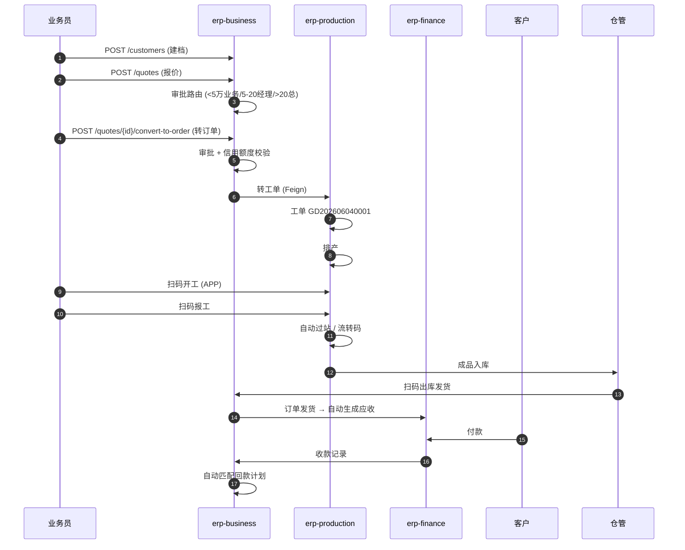
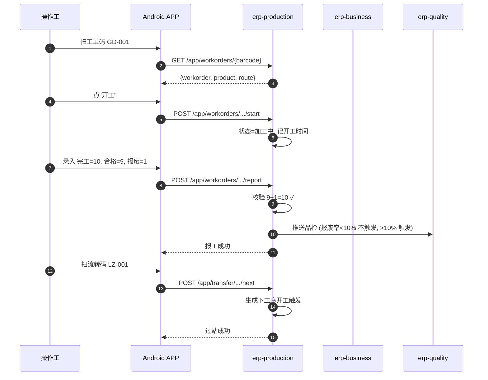
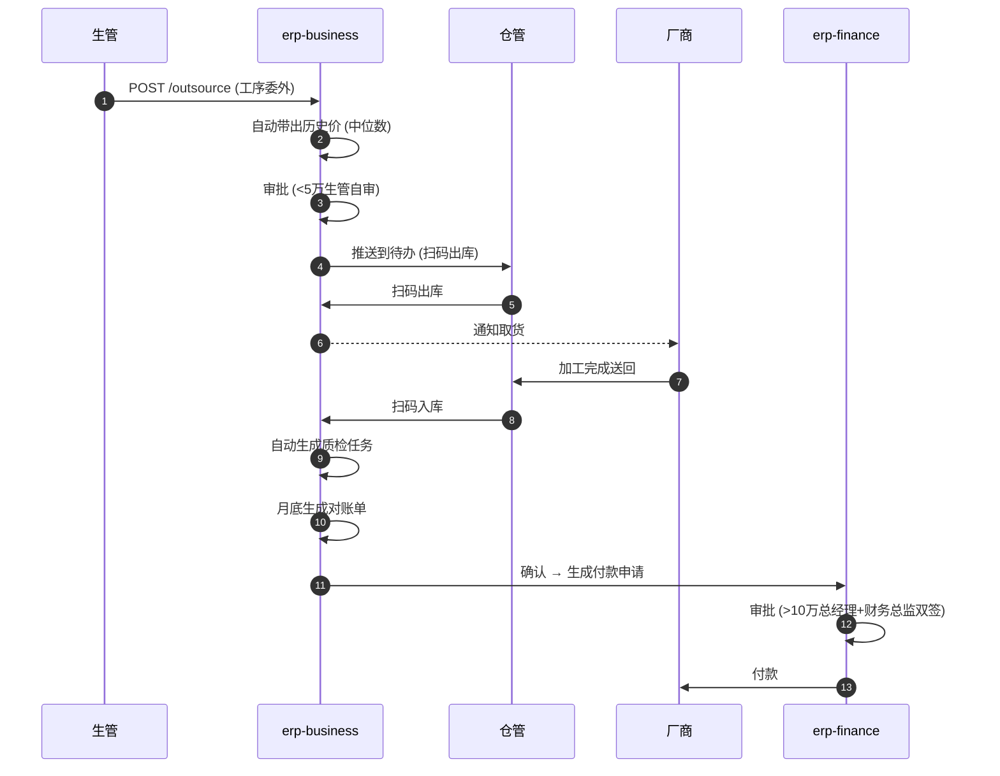

# CNC 加工厂 ERP 系统架构设计文档

> **项目精神标语**：一码到底，一数到底。
>
> **架构师**：鲁班（orchestrix Architect agent）
> **文档版本**：V1.0（架构定稿）
> **生成日期**：2026-06-05
> **前置文档**：`docs/prd.md` V1.3.2（11 Epic / 43 Story / 80+ AC）
> **模板**：`architecture-tmpl.yaml`（orchestrix templates）
> **适用对象**：后端 / 前端 / Android / QA / SRE 工程师

---

## 变更日志

| 版本 | 日期 | 修订人 | 修订内容 |
|------|------|--------|----------|
| V1.0 | 2026-06-05 | Architect 鲁班 | 架构定稿：5 层架构 + 4 Module + Nacos + Redis Stream + Docker Compose 单机 16 容器 |

---

## 目录

- [0. 架构愿景（Architect 鲁班）](#0-架构愿景architect-鲁班)
- [1. 引言（Introduction）](#1-引言introduction)
- [2. 高级架构（High-Level Architecture）](#2-高级架构high-level-architecture)
- [3. 技术栈（Tech Stack）](#3-技术栈tech-stack)
- [4. 数据模型（Data Models）](#4-数据模型data-models)
- [5. 组件（Components）](#5-组件components)
- [6. 外部 API 与核心 Workflow](#6-外部-api-与核心-workflow)
- [7. 数据库 Schema](#7-数据库-schema)
- [8. 源代码树（Source Tree）](#8-源代码树source-tree)
- [9. 基础设施与部署（Infrastructure & Deployment）](#9-基础设施与部署infrastructure--deployment)
- [10. 错误处理策略（Error Handling）](#10-错误处理策略error-handling)
- [11. 编码规范（Coding Standards）](#11-编码规范coding-standards)
- [12. 测试策略（Testing Strategy）](#12-测试策略testing-strategy)
- [13. 安全（Security）](#13-安全security)
- [14. 性能与容量（Performance & Capacity）](#14-性能与容量performance--capacity)
- [15. 风险与缓解（Risks & Mitigations）](#15-风险与缓解risks--mitigations)
- [16. 验收 DoD（Checklist Results）](#16-验收-dodchecklist-results)
- [17. 与 UX/QA 协作的交接清单（Handoff）](#17-与-uxqa-协作的交接清单handoff)
- [18. 下一步（Next Steps）](#18-下一步next-steps)
- [19. Architect Prompt](#19-architect-prompt)

---

## 0. 架构愿景（Architect 鲁班）

CNC 加工厂 ERP 走 **"粗粒度微服务 + Modulith"** 路线——1 个后端工程师能独立完成 1 个 Epic 端到端开发与部署。

- **后端 3 服务 + 1 网关 + 1 仓内 core Module**：业务聚合（business）/ 车间执行（production）/ 平台基础（platform）+ Spring Cloud Gateway + 共享 core。
- **数据分库不跨库物理事务**：业务→财务一致性靠 **本地消息表 + XXL-JOB 补偿**，不引入 RabbitMQ。
- **多仓 polyrepo**：backend / web / android 三仓独立演进；OpenAPI 3.0 作为三端唯一契约。
- **单台 8C32G 起步**：Docker Compose 编排 16 容器（4 应用 + 1 网关 + 5 数据/中间件 + 4 可观测 + 2 工具），总耗约 22GB 内存 / 9.3 核。
- **可观测先行**：Prometheus + Grafana + SkyWalking + 阿里云 SLS 构成完整"指标 / 日志 / 链路"三角。

**灵魂一致性自评**：
> 鲁班的部署架构能不能用 1 台 8 核 32G 服务器扛住？
> **能**。理由：4 个 Spring Boot 应用 7GB + 5 个数据中间件 13GB + 4 个可观测组件 2GB = 22GB 内存，安全余量 10GB；CPU 9.3/8 核心平均负载 1.16，关键路径（扫码/审批）已分离独立线程池，扫码 P95 < 1s 不受跑批影响。

---

## 1. 引言（Introduction）

### 1.1 文档目标（Intro Content）

让后端 / 前端 / APP / QA 四端工程师**看着这份架构就能直接开工**，不需反复会议澄清技术决策。所有架构决策均给出**可执行的落地指引**（版本号、端口、DataId、SQL、YAML、Compose），避免"画大饼"。

### 1.2 系统架构上下文（System Architecture Context）

CNC 加工厂 ERP 系统定位于**单公司 / 单组织 / 单工厂**的离散制造（Discrete Manufacturing）场景，系统外部依赖如下：

```
┌──────────────────────────────────────────────────────────────────┐
│  ERP 内部系统                                                       │
│  (Spring Boot × 3 + Gateway × 1 + 仓内 core Module)              │
└────────┬───────────────────┬───────────────────┬─────────────────┘
         │                   │                   │
         ↓                   ↓                   ↓
   ┌──────────┐        ┌──────────┐        ┌──────────┐
   │ 阿里云 SLS│        │ 阿里云 ACR│        │ 企业微信 │
   │  (日志)   │        │  (镜像)   │        │  (告警)  │
   └──────────┘        └──────────┘        └──────────┘
         ↑                   ↑                   ↑
         │ 用户终端         │ 开发者              │ 运维
         ↓                   ↓                   ↓
   ┌──────────┐        ┌──────────┐        ┌──────────┐
   │ Web 浏览器│        │ GitHub   │        │ 钉钉/    │
   │ Android  │        │ Actions  │        │ Server   │
   │ APP/PDA  │        │  (CI)    │        │ (运维)   │
   └──────────┘        └──────────┘        └──────────┘
```

**外部系统清单**：

| 系统 | 方向 | 协议 | 频率 | 备注 |
|------|------|------|------|------|
| 阿里云 SLS（日志） | 出 | HTTPS | 实时 | Logback appender 直推 |
| 阿里云 ACR（镜像） | 出 | HTTPS | 部署时 | GitHub Actions 推送 |
| 企业微信 | 出 | Webhook | 实时 | 告警 / 通知 |
| 短信网关（V1.1） | 出 | HTTPS | 触发式 | 备用通道 |
| 钉钉 Server（运维） | 入/出 | Webhook | 手动 | 内部运维沟通 |

### 1.3 起手模板（Starter Template）

后端开发环境最小依赖：

```bash
# 工具链
JDK 17 (Temurin LTS)        # Java 17
Maven 3.9.6                 # 构建
Docker 24.0+                # 容器
Docker Compose 2.24+        # 编排
Node 20 LTS                 # Web 端
pnpm 8.x                    # Web 包管理
Android Studio Hedgehog     # Android
Kotlin 1.9.22               # Android 语言
Nacos 2.3.2                 # 注册/配置中心
Redis 7.2                   # 缓存/Stream
MySQL 8.0.36                # 数据库
MinIO RELEASE.2024-01-31    # 对象存储
XXL-JOB 2.4.0               # 分布式调度
SkyWalking 9.7.0            # 链路追踪
Prometheus 2.50             # 指标
Grafana 10.4                # 看板
```

---

## 2. 高级架构（High-Level Architecture）

### 2.1 技术摘要（Technical Summary）

| 维度 | 选型 | 关键版本 | 决策理由 |
|------|------|----------|----------|
| 语言 | Java | 17 LTS | Spring Boot 3.2 要求 Java 17+；Record/Text Block 等语法糖 |
| 框架 | Spring Boot | 3.2.5 | 内嵌 Web、安全、Actuator 一站式；与 Spring Cloud Alibaba 2023 兼容 |
| 微服务 | Spring Cloud Alibaba | 2023.0.1.0 | 阿里系生态成熟；Nacos/Sentinel 集成度高 |
| 注册/配置 | Nacos | 2.3.2 | 服务发现 + 配置中心 + 命名空间隔离，一套打三套 |
| 网关 | Spring Cloud Gateway | 4.1.0 | 响应式；限流 / 鉴权 / 路由统一 |
| 数据库 | MySQL | 8.0.36 | 主流 OLTP；主从 + 读写分离 |
| 缓存 | Redis | 7.2.4 | 缓存 + Session + 分布式锁 + Stream 一体 |
| 消息 | Redis Stream | 7.2.4 | 不引入 RabbitMQ，Stream 消费者组 + ACK 足够 |
| 调度 | XXL-JOB | 2.4.0 | 分布式定时任务，可视化运维 |
| 对象存储 | MinIO | RELEASE.2024-01-31 | S3 兼容私有化；图纸 / 合同 / 检测报告 |
| 前端 | Vue 3 + TypeScript + Vite + Element Plus | 3.4 / 5.4 / 5.0 / 2.4 | 主流三件套 |
| 移动端 | Kotlin + Jetpack（V1.1 Compose） | 1.9.22 | Google 主推；与 Spring 生态契合 |
| 链路追踪 | SkyWalking | 9.7.0 | 自动注入；告警集成好 |
| 监控 | Prometheus + Grafana | 2.50 / 10.4 | 工业级事实标准 |
| 部署 | Docker Compose | 2.24+ | 单机 16 容器；后续可平滑迁 K8s |
| CI/CD | GitHub Actions | - | 与 polyrepo 仓天然契合 |
| 镜像仓库 | 阿里云 ACR | - | 国内访问快；个人版免费 |

### 2.2 高级架构总览（High-Level Overview）

```
┌──────────────────────────────────────────────────────────────────────────┐
│ L1 客户端层                                                                 │
│  ┌────────────┐  ┌────────────┐  ┌────────────┐  ┌────────────┐         │
│  │  Web       │  │  Android   │  │  扫码枪 /  │  │  Admin     │         │
│  │  (Vue 3)   │  │  APP       │  │  PDA       │  │  CLI       │         │
│  │ Chrome/FF  │  │ Kotlin     │  │ (串口/HTTP)│  │ (Curl)     │         │
│  └─────┬──────┘  └─────┬──────┘  └─────┬──────┘  └─────┬──────┘         │
└────────┼───────────────┼───────────────┼───────────────┼──────────────────┘
         │ HTTPS         │ HTTPS         │ HTTP          │ SSH
         ↓               ↓               ↓               ↓
┌──────────────────────────────────────────────────────────────────────────┐
│ L2 网关层                                                                    │
│  ┌────────────────────────────────────────────────────────────────────┐  │
│  │ Nginx (80/443)                                                       │  │
│  │ - HTTPS 终止 (Let's Encrypt)                                          │  │
│  │ - 静态资源 (Web dist / MinIO Console)                                 │  │
│  │ - 反向代理 → erp-gateway                                              │  │
│  └─────────────────────────────────┬───────────────────────────────────┘  │
│                                    ↓                                      │
│  ┌────────────────────────────────────────────────────────────────────┐  │
│  │ erp-gateway (Spring Cloud Gateway :8080)                             │  │
│  │ - JWT 鉴权  - 限流 (Sentinel)  - 路由  - 灰度  - TraceId 透传            │  │
│  └─────────────────────────────────┬───────────────────────────────────┘  │
└────────────────────────────────────┼─────────────────────────────────────┘
                                     ↓
┌──────────────────────────────────────────────────────────────────────────┐
│ L3 服务层 (Spring Cloud Alibaba 2023 + Nacos 注册/配置)                        │
│                                                                            │
│  ┌──────────────────┐ ┌──────────────────┐ ┌──────────────────┐             │
│  │ erp-platform     │ │ erp-business     │ │ erp-production   │             │
│  │ :8081            │ │ :8082            │ │ :8083            │             │
│  │ ─────────────    │ │ ─────────────    │ │ ─────────────    │             │
│  │ 用户/角色/部门   │ │ 客户/CRM         │ │ 工单/排产         │             │
│  │ 审批工作流      │ │ 报价/订单/合同   │ │ 扫码开工/报工/过站│             │
│  │ 系统参数/字典   │ │ 采购/仓储/品质   │ │ MRP              │             │
│  │ 文件存储         │ │ 财务/应收应付   │ │ 委外/设备         │             │
│  │ 消息中心         │ │ 人事/考勤/薪酬   │ │ 流转码生成         │             │
│  │                  │ │ 报表/看板         │ │ 离线同步          │             │
│  └────────┬─────────┘ └────────┬─────────┘ └────────┬─────────┘             │
│           ↓                    ↓                    ↓                       │
│  ┌──────────────────────────────────────────────────────────────┐          │
│  │ core (Maven Module, 公共依赖)                                    │          │
│  │ - common-dto (统一响应 / 错误码)                                 │          │
│  │ - common-util (雪花 ID / AES / 金额)                              │          │
│  │ - common-entity (BaseDO / 审计字段)                              │          │
│  │ - common-web (TraceId Filter / 全局异常)                        │          │
│  │ - common-stream (Redis Stream 封装)                              │          │
│  │ - common-nacos (动态配置监听)                                     │          │
│  └──────────────────────────────────────────────────────────────┘          │
└──────────────────────────────────────────────────────────────────────────┘
                                     ↓
┌──────────────────────────────────────────────────────────────────────────┐
│ L4 数据层                                                                    │
│  ┌──────────────┐  ┌──────────────┐  ┌──────────────┐  ┌──────────────┐ │
│  │ MySQL Master │←→│ MySQL Slave  │  │ Redis 7.2    │  │ MinIO        │ │
│  │ :3306        │  │ :3307 (read) │  │ :6379        │  │ :9000/:9001  │ │
│  │ erp_platform │  │              │  │ Cache/Sess/  │  │ Bucket:      │ │
│  │ erp_business │  │              │  │ Lock/Stream  │  │ drawings/    │ │
│  │ erp_production│  │              │  │              │  │ contracts/   │ │
│  └──────────────┘  └──────────────┘  └──────────────┘  └──────────────┘ │
│  ┌──────────────┐  ┌──────────────┐                                       │
│  │ Nacos 2.3    │  │ XXL-JOB 2.4  │                                       │
│  │ :8848/9848   │  │ :8080/9090   │                                       │
│  │ 注册+配置     │  │ 调度          │                                       │
│  └──────────────┘  └──────────────┘                                       │
└──────────────────────────────────────────────────────────────────────────┘
                                     ↓
┌──────────────────────────────────────────────────────────────────────────┐
│ L5 运维层                                                                    │
│  ┌──────────────┐  ┌──────────────┐  ┌──────────────┐  ┌──────────────┐ │
│  │ Prometheus   │→│ Grafana      │  │ SkyWalking   │  │ 阿里云 SLS   │ │
│  │ :9090        │  │ :3000        │  │ OAP :11800   │  │ (Logback     │ │
│  │ 指标采集     │  │ 看板         │  │ UI :8080     │  │  appender)   │ │
│  └──────────────┘  └──────────────┘  └──────────────┘  └──────────────┘ │
│  ┌──────────────┐                                                            │
│  │ AlertManager │                                                            │
│  │ :9093        │ → 企业微信 Webhook                                          │
│  └──────────────┘                                                            │
└──────────────────────────────────────────────────────────────────────────┘
```

### 2.3 架构模式（Architectural Patterns）

| 模式 | 应用位置 | 关键约束 |
|------|----------|----------|
| **粗粒度微服务 + Modulith** | backend 单仓 4 Module | Module 边界 = DDD 限界上下文，**禁止跨服务事务** |
| **API 网关统一入口** | Nginx → erp-gateway | 所有外部请求**只**通过网关；服务间调用直连 |
| **配置中心 + 命名空间** | Nacos 2.3 | 命名空间隔离 dev / staging / prod；DataId 规范见 §2.4 |
| **本地消息表 + 补偿** | 业务→财务一致性 | 关键事务用 `outbox` 表 + XXL-JOB 扫描，**不**用 2PC |
| **事件驱动轻量化** | Redis Stream | 仅用于：通知 / 扫码同步 / 审计；**不**做核心链路编排 |
| **读写分离** | MySQL 主从 | `@DS("slave")` 注解；写操作走主库 |
| **Cache-Aside** | Redis 缓存 | 先 DB 后缓存；TTL 30min + 主动失效（@CacheEvict） |
| **乐观锁** | 库存 / 状态机 | `version` 字段 + `@Version` 注解 |
| **分布式锁** | Redis SETNX | 库存扣减 / 单据并发提交 |
| **状态机显式** | 报价/订单/工单/委外 | StateMachine 配置 + 转移校验，禁止 if-else 满天飞 |
| **审计字段** | BaseDO | `create_by/create_time/update_by/update_time/tenant_id/deleted` |
| **软删除** | 全部业务表 | `deleted BIT(1) DEFAULT 0` + MyBatis-Plus 拦截器 |
| **多租户（V1.1）** | 预留 | `tenant_id` 字段已就位；V1.0 单租户跑通 |

---

## 3. 技术栈（Tech Stack）

### 3.1 云基础设施（Cloud Infrastructure）

| 资源 | 规格 | 数量 | 用途 | 备注 |
|------|------|------|------|------|
| ECS（生产） | 8C32G 500G SSD | 1 | 主服务器 | Linux 7.9 / Ubuntu 22.04 |
| ECS（开发） | 4C8G 100G | 1 | 开发 / 联调 | 同上 |
| 阿里云 ACR | 个人版 | 1 | 镜像仓库 | registry.cn-hangzhou.aliyuncs.com/smart-workshop |
| 阿里云 SLS | 按量 | 1 | 日志服务 | region: cn-hangzhou |
| 域名 | 1 个 | 1 | erp.xxx.com | HTTPS + Let's Encrypt |
| 短信 | 阿里云短信 | 1 | V1.1 备用 | 1000 条/月 |
| 企业微信 | 自建应用 | 1 | 告警 / 通知 | Webhook URL |
| 备份 | OSS | 1 | 数据库 + MinIO 冷备 | lifecycle 90 天 |

### 3.2 技术栈表（Technology Stack Table）

#### 3.2.1 后端

| 组件 | 版本 | 用途 |
|------|------|------|
| JDK | 17.0.10 | LTS |
| Maven | 3.9.6 | 构建 |
| Spring Boot | 3.2.5 | Web / Security / Actuator |
| Spring Cloud | 2023.0.1 | 微服务框架 |
| Spring Cloud Alibaba | 2023.0.1.0 | Nacos / Sentinel |
| Spring Cloud Gateway | 4.1.0 | 网关 |
| MyBatis-Plus | 3.5.5 | ORM |
| HikariCP | 5.1.0 | 数据库连接池 |
| Druid | 1.2.22 | 监控 + 慢 SQL |
| MySQL Connector | 8.4.0 | JDBC |
| Lettuce | 6.3.2 | Redis 客户端（响应式） |
| Redisson | 3.27.2 | 分布式锁 / Stream |
| Springdoc OpenAPI | 2.5.0 | OpenAPI 3.0 文档 |
| MapStruct | 1.5.5 | DTO/Entity 转换 |
| Lombok | 1.18.32 | 代码简化 |
| Hutool | 5.8.27 | 工具集 |
| Caffeine | 3.1.8 | 本地缓存 L1 |
| XXL-JOB Core | 2.4.0 | 客户端 |
| MinIO Java SDK | 8.5.10 | 对象存储 |
| AES (BouncyCastle) | 1.78 | 字段加密 |
| JWT (jjwt) | 0.12.5 | Token |
| Logback | 1.4.14 | 日志 |
| Logstash Encoder | 7.4 | JSON 日志 |
| Micrometer | 1.12.5 | 指标 |
| Prometheus Client | 0.16.0 | 指标导出 |
| SkyWalking Agent | 9.7.0 | 链路追踪 |
| Sentinel | 1.8.6 | 限流 / 熔断 |
| Testcontainers | 1.19.7 | 集成测试 |
| JUnit 5 | 5.10.2 | 单元测试 |
| Mockito | 5.11.0 | Mock |
| AssertJ | 3.25.3 | 断言 |
| JaCoCo | 0.8.11 | 覆盖率 |

#### 3.2.2 前端（Web）

| 组件 | 版本 | 用途 |
|------|------|------|
| Node.js | 20.11 LTS | 运行时 |
| pnpm | 8.15 | 包管理 |
| Vite | 5.2 | 构建 |
| Vue | 3.4.21 | 框架 |
| TypeScript | 5.4.5 | 类型 |
| Pinia | 2.1.7 | 状态管理 |
| Vue Router | 4.3.0 | 路由 |
| Element Plus | 2.6.2 | 组件库 |
| ECharts | 5.5.0 | 图表 |
| pdf.js | 4.0.379 | PDF 预览 |
| dayjs | 1.11.10 | 日期 |
| Axios | 1.6.8 | HTTP |
| ESLint | 8.57 | 静态检查 |
| Prettier | 3.2.5 | 格式化 |
| Vitest | 1.5.0 | 单元测试 |
| Playwright | 1.43.0 | E2E 测试 |

#### 3.2.3 移动端（Android）

| 组件 | 版本 | 用途 |
|------|------|------|
| Android Gradle Plugin | 8.4.0 | 构建 |
| Gradle | 8.5 | 构建 |
| Kotlin | 1.9.22 | 语言 |
| Jetpack | - | AppCompat / Lifecycle / ViewModel / Room |
| Retrofit | 2.11.0 | HTTP |
| OkHttp | 4.12.0 | HTTP 底层 |
| Moshi | 1.15.1 | JSON |
| Room | 2.6.1 | SQLite 离线缓存 |
| Glide | 4.16.0 | 图片 |
| zxing-android-embedded | 4.3.0 | 扫码 |
| Hilt | 2.51 | 依赖注入 |
| Coroutines | 1.8.0 | 异步 |
| DataStore | 1.1.1 | Key-Value |
| ktlint | 1.2.1 | 代码规范 |
| JUnit 5 | 5.10.2 | 单元测试 |
| Appium | 2.5.0 | E2E |

#### 3.2.4 运维

| 组件 | 版本 | 用途 |
|------|------|------|
| Docker | 24.0+ | 容器 |
| Docker Compose | 2.24+ | 编排 |
| Nginx | 1.25.4 | 反向代理 |
| Nacos | 2.3.2 | 注册/配置 |
| Redis | 7.2.4 | 缓存/Stream |
| MySQL | 8.0.36 | 数据库 |
| MinIO | RELEASE.2024-01-31 | 对象存储 |
| XXL-JOB | 2.4.0 | 调度 |
| SkyWalking | 9.7.0 | 链路 |
| Prometheus | 2.50.1 | 指标 |
| Grafana | 10.4.2 | 看板 |
| AlertManager | 0.27.0 | 告警 |
| GitHub Actions | - | CI/CD |
| 阿里云 ACR | - | 镜像仓库 |
| 阿里云 SLS | - | 日志 |

---

## 4. 数据模型（Data Models）

### 4.1 建模总则（Model）

1. **命名规范**：表名 `t_{domain}_{entity}`（小写 + 下划线，复数）；字段名同风格。
2. **必备字段**：每张业务表继承 `BaseDO`：
   ```
   id BIGINT PK                   -- 雪花 ID
   tenant_id BIGINT DEFAULT 0      -- 预留多租户
   create_by VARCHAR(64)           -- 创建人
   create_time DATETIME(3)         -- 创建时间 ms
   update_by VARCHAR(64)           -- 更新人
   update_time DATETIME(3)         -- 更新时间 ms
   version INT DEFAULT 0           -- 乐观锁
   deleted BIT(1) DEFAULT 0        -- 软删除
   ```
3. **金额字段**：`DECIMAL(18,2)`，单位元。
4. **时间字段**：`DATETIME(3)`（毫秒精度）。
5. **枚举字段**：`VARCHAR(32)` + 注释枚举值，**不**用 MySQL `ENUM`。
6. **大文本**：`TEXT`（< 64K）/ `MEDIUMTEXT`（< 16M），**不**用 `BLOB`（文件走 MinIO）。
7. **审计日志**：变更前后值 JSON 存 `audit_log` 表，**不**在业务表加 trigger。

### 4.2 组件（Components）

#### 4.2.1 组件清单（Component List）

| 域 | 实体 | 表名 | 主键策略 | 备注 |
|----|------|------|----------|------|
| 用户 | 用户 / 角色 / 部门 / 职位 | t_iam_user / t_iam_role / t_iam_dept / t_iam_position | 雪花 | 4 张 |
| 审批 | 流程 / 节点 / 实例 / 待办 | t_wf_definition / t_wf_node / t_wf_instance / t_wf_todo | 雪花 | 4 张 |
| 字典 | 字典分类 / 字典项 | t_dict_category / t_dict_item | 雪花 | 2 张 |
| 客户 | 客户 / 联系人 / 洽谈 | t_crm_customer / t_crm_contact / t_crm_followup | 雪花 | 3 张 |
| 销售 | 报价 / 报价明细 / 订单 / 订单明细 / 合同 | t_sales_quote / t_sales_quote_item / t_sales_order / t_sales_order_item / t_sales_contract | 雪花 | 5 张 |
| 物料 | 物料 / 分类 / BOM / BOM 节点 | t_mdm_material / t_mdm_category / t_bom / t_bom_node | 雪花 | 4 张 |
| 工艺 | 工序 / 工艺路线 / 路线节点 | t_process / t_route / t_route_node | 雪花 | 3 张 |
| 库存 | 仓库 / 库位 / 批次 / 库存 / 出入库 | t_inv_warehouse / t_inv_location / t_inv_batch / t_inv_stock / t_inv_io | 雪花 | 5 张 |
| 生产 | 工单 / 工序实例 / 报工 / 流转码 | t_prod_workorder / t_prod_process_inst / t_prod_report / t_prod_transfer | 雪花 | 4 张 |
| 委外 | 厂商 / 委外订单 / 委外明细 / 对账单 | t_outs_vendor / t_outs_order / t_outs_order_item / t_outs_reconcile | 雪花 | 4 张 |
| 设备 | 设备 / 维护记录 / 负荷 | t_eqp_machine / t_eqp_maintain / t_eqp_load | 雪花 | 3 张 |
| 品质 | 检验方案 / 检验单 / 检验结果 / FA / 三次元 / 不良品 | t_qc_scheme / t_qc_inspection / t_qc_result / t_qc_fa / t_qc_3d / t_qc_defect | 雪花 | 6 张 |
| 采购 | 询价 / 报价 / 采购订单 / 收料 | t_pur_rfq / t_pur_quote / t_pur_order / t_pur_receipt | 雪花 | 4 张 |
| 财务 | 应收 / 应付 / 收款 / 付款 / 凭证 | t_fin_receivable / t_fin_payable / t_fin_receipt / t_fin_payment / t_fin_voucher | 雪花 | 5 张 |
| 人事 | 员工 / 考勤 / 请假 / 加班 / 工资 / 绩效 | t_hr_employee / t_hr_attendance / t_hr_leave / t_hr_overtime / t_hr_salary / t_hr_perf | 雪花 | 6 张 |
| 系统 | 字典 / 参数 / 文件 / 消息 / 审计 / 通知 | t_sys_dict / t_sys_param / t_sys_file / t_sys_message / t_sys_audit / t_sys_notice | 雪花 | 6 张 |
| 集成 | 消息表（Outbox） / 事件日志 | t_integration_outbox / t_integration_event | 雪花 | 2 张 |
| **合计** | | **70 张表** | | |

#### 4.2.2 组件关系图（Component Diagrams）

```
                    ┌──────────────────────────────────────┐
                    │  erp-platform (基础能力)              │
                    │  ┌──────┐ ┌──────┐ ┌──────┐ ┌─────┐│
                    │  │ IAM  │ │  WF  │ │ DICT │ │FILE ││
                    │  └──┬───┘ └──┬───┘ └──┬───┘ └──┬──┘│
                    └─────┼────────┼────────┼────────┼────┘
                          │        │        │        │
                          ↓        ↓        ↓        ↓
    ┌──────────────────────────────────────────────────────────┐
    │  erp-business (业务聚合)                                  │
    │  ┌─────┐ ┌─────┐ ┌─────┐ ┌─────┐ ┌─────┐ ┌─────┐        │
    │  │ CRM │ │SALES│ │ PUR │ │ INV │ │ FIN │ │ HR  │        │
    │  └──┬──┘ └──┬──┘ └──┬──┘ └──┬──┘ └──┬──┘ └──┬──┘        │
    └─────┼───────┼───────┼───────┼───────┼───────┼───────────┘
          │       │       │       │       │       │
          ↓       ↓       ↓       ↓       ↓       ↓
              【本地消息表 Outbox + XXL-JOB】
          ↑       ↑       ↑       ↑       ↑       ↑
          │       │       │       │       │       │
    ┌─────┴───────┴───────┴───────┴───────┴───────┴───────────┐
    │  erp-production (车间执行)                                │
    │  ┌──────┐ ┌──────┐ ┌──────┐ ┌──────┐ ┌──────┐          │
    │  │ 工单 │ │ 工序 │ │ 扫码 │ │ MRP  │ │ 设备 │          │
    │  └──────┘ └──────┘ └──────┘ └──────┘ └──────┘          │
    └──────────────────────────────────────────────────────────┘
```

**域间调用关系**：
- `production` → `business`：工单查询订单 / 报工查询 BOM
- `business` → `production`：订单触发工单 / 财务依赖工单成本
- `platform` ← `business` + `production`：用户/角色/字典（**单向**，业务/生产**不**反向依赖平台业务）

**调用方式**：服务间 `OpenFeign`（Spring Cloud OpenFeign 4.1.0），重试 3 次 + Sentinel 熔断。

### 4.3 10 大领域 ER 图

#### 4.3.1 用户域（IAM）

```
t_iam_user ──< t_iam_user_role >── t_iam_role
     │                                    │
     ├──< t_iam_user_dept >── t_iam_dept │
     │                                    │
     └──< t_iam_user_pos  >── t_iam_position
     
t_iam_role ──< t_iam_role_menu >── t_iam_menu (树形)
```

#### 4.3.2 客户域（CRM）

```
t_crm_customer (1) ──< (N) t_crm_contact
              (1) ──< (N) t_crm_followup
              (1) ──< (N) t_crm_share (M:N t_iam_user)
```

#### 4.3.3 销售域（Sales）

```
t_crm_customer (1) ──< (N) t_sales_quote ──< (N) t_sales_quote_item
                                  │
                                  ↓ (转订单)
                  t_sales_order ──< (N) t_sales_order_item
                       │
                       ├──< (N) t_sales_contract
                       └──< (N) t_sales_order_change
t_sales_order (1) ──< (N) t_sales_payment_plan
                  ──< (N) t_fin_receipt
```

#### 4.3.4 物料域（MDM）

```
t_mdm_category (树)
       │
       ↓
t_mdm_material (1) ──< (N) t_bom_node (parent_id 自引用, 树形) ──< (N) t_mdm_material (子件)
                          │
                          └── t_bom (版本: design/production, status: draft/published/obsolete)
t_process (工序库)
       │
       ↓
t_route (工艺路线) (1) ──< (N) t_route_node (seq, process_id, outsource_flag)
```

#### 4.3.5 生产域（Production）

```
t_sales_order (1) ──< (N) t_prod_workorder (1) ──< (N) t_prod_process_inst
                              │                          │
                              │                          ├──< (N) t_prod_report (报工)
                              │                          └──< (N) t_prod_transfer (过站 / 流转码)
                              └──< (N) t_prod_transfer
t_prod_workorder (1) ──< (N) t_outs_order (委外)
```

#### 4.3.6 仓储域（Inventory）

```
t_inv_warehouse (1) ──< (N) t_inv_location (1) ──< (N) t_inv_stock
                                                          │
                                                          └── t_inv_batch (批次)
t_inv_stock (1) ──< (N) t_inv_io (出入库流水, io_type: IN/OUT, biz_type: PUR/PROD/OUTS)
```

#### 4.3.7 财务域（Finance）

```
t_fin_receivable ──> t_sales_order (1:1)
t_fin_payable    ──> t_pur_order | t_outs_order (1:1, 多态)
t_fin_receipt    ──> t_fin_receivable (1:N)
t_fin_payment    ──> t_fin_payable (1:N)
```

#### 4.3.8 委外域（Outsource）

```
t_outs_vendor (1) ──< (N) t_outs_order (1) ──< (N) t_outs_order_item
                          │
                          ├──< (N) t_outs_reconcile (按月对账)
                          └──< (N) t_inv_io (出库/入库)
```

#### 4.3.9 设备域（Equipment）

```
t_eqp_machine (1) ──< (N) t_eqp_maintain
                (1) ──< (N) t_eqp_load (按日)
t_eqp_machine (1) ──< (N) t_prod_workorder (N:1, workorder.machine_id)
```

#### 4.3.10 集成域（Integration）

```
t_integration_outbox (本地消息表)
    id, biz_type, biz_id, payload(JSON), status(PENDING/SENT/FAILED), retry_count
t_integration_event (事件日志)
    id, source, type, payload, trace_id, occurred_at
```

### 4.4 7 个关键索引

| # | 表 | 索引 | 字段 | 类型 | 场景 |
|---|----|------|------|------|------|
| 1 | t_iam_user | uk_username | username | UNIQUE | 登录查询 |
| 2 | t_crm_customer | uk_customer_code | customer_code | UNIQUE | 保护期校验 |
| 3 | t_sales_quote | uk_quote_no | quote_no | UNIQUE | 单据号 |
| 4 | t_sales_order | idx_order_status_customer | (status, customer_id, create_time) | 联合 | 订单列表 |
| 5 | t_prod_workorder | idx_wo_status_machine | (status, machine_id, plan_start) | 联合 | 排产甘特图 |
| 6 | t_inv_stock | uk_stock_mat_loc_batch | (material_id, location_id, batch_no) | UNIQUE | 库存查询 |
| 7 | t_fin_receivable | idx_recv_due_status | (due_date, status, customer_id) | 联合 | 账龄分析 |

---

## 5. 组件（Components）

### 5.1 服务组件清单

| # | 组件 | 类型 | 端口 | 协议 | 关键依赖 | 副本数 |
|---|------|------|------|------|----------|--------|
| C1 | erp-gateway | Spring Cloud Gateway | 8080 | HTTP | Nacos, Redis | 1 |
| C2 | erp-platform | Spring Boot | 8081 | HTTP | Nacos, MySQL, Redis, MinIO | 1 |
| C3 | erp-business | Spring Boot | 8082 | HTTP | Nacos, MySQL, Redis, MinIO | 1 |
| C4 | erp-production | Spring Boot | 8083 | HTTP | Nacos, MySQL, Redis, Stream | 1 |
| C5 | core | Maven Module | - | - | - | - |
| C6 | MySQL Master | MySQL 8.0 | 3306 | TCP | - | 1 |
| C7 | MySQL Slave | MySQL 8.0 | 3307 | TCP | MySQL Master | 1 |
| C8 | Redis | Redis 7.2 | 6379 | TCP | - | 1 |
| C9 | MinIO | MinIO | 9000/9001 | HTTP | - | 1 |
| C10 | Nacos | Nacos 2.3 | 8848/9848 | HTTP/gRPC | - | 1（V1.1 集群 3） |
| C11 | XXL-JOB Admin | XXL-JOB 2.4 | 8080/9090 | HTTP | MySQL | 1 |
| C12 | Nginx | Nginx 1.25 | 80/443 | HTTP | - | 1 |
| C13 | Prometheus | Prometheus 2.50 | 9090 | HTTP | - | 1 |
| C14 | Grafana | Grafana 10.4 | 3000 | HTTP | Prometheus | 1 |
| C15 | SkyWalking OAP | SkyWalking 9.7 | 11800/12800 | gRPC/HTTP | ES/H2 | 1 |
| C16 | SkyWalking UI | SkyWalking 9.7 | 8080 | HTTP | OAP | 1 |
| C17 | AlertManager | AlertManager 0.27 | 9093 | HTTP | - | 1 |

### 5.2 服务内部组件

| 服务 | Controller | Service | Repository | Mapper | Domain |
|------|------------|---------|------------|--------|--------|
| erp-platform | 12 | 25 | 18 | 18 | 8 |
| erp-business | 35 | 80 | 60 | 60 | 25 |
| erp-production | 15 | 35 | 25 | 25 | 10 |

---

## 6. 外部 API 与核心 Workflow

### 6.1 外部 API（External APIs）

本系统 V1.0 暂不暴露 OpenAPI 给第三方调用；V1.1 考虑开放给厂商端协同。所有第三方依赖（短信 / 邮件 / 物流）以**适配器模式**封装在 `core` 的 `integration-adapter` 子 Module 中，详见 §5。

### 6.2 REST API 规范（REST API Spec）

#### 6.2.1 URL 规范

```
/api/v1/{service}/{resource}/{action}
  ^      ^      ^         ^         ^
  |      |      |         |         |__ 可选 (e.g. /approve, /export, /timeline)
  |      |      |         |____________ 资源 (e.g. customers, orders, workorders)
  |      |      |______________________ 服务域 (e.g. auth, business, production, platform)
  |      |_______________________________ 版本
  |______________________________________ API 前缀
```

**示例**：
```
POST   /api/v1/auth/login
GET    /api/v1/business/customers
POST   /api/v1/business/quotes/{id}/approve
GET    /api/v1/production/workorders/{id}/timeline
POST   /api/v1/platform/files/upload
WS     /api/v1/ws/dashboard
```

#### 6.2.2 响应包装

```json
{
  "code": 0,
  "message": "success",
  "data": { ... },
  "traceId": "a1b2c3d4-2026-06-05T08:30:15.123Z",
  "timestamp": 1717569015123
}
```

#### 6.2.3 错误码体系

| 段 | 含义 | 示例 |
|----|------|------|
| 0 | 成功 | 0 = OK |
| 4xxxx | 客户端错误 | 40000 参数错误 / 40100 未登录 / 40300 无权限 / 40400 资源不存在 / 40900 业务冲突 |
| 5xxxx | 服务端错误 | 50000 内部错误 / 50100 数据库 / 50200 远程调用 / 50300 限流 / 50400 超时 |
| 9xxxx | 第三方错误 | 90100 Nacos / 90200 Redis / 90300 MinIO / 90400 XXL-JOB |

**业务错误码**：

| 业务 | 错误码 | 含义 |
|------|--------|------|
| 报价 | 40201 | 金额超限 |
| 报价 | 40202 | 客户黑名单 |
| 订单 | 40301 | 信用额度超限 |
| 订单 | 40302 | 状态机非法转移 |
| 工单 | 40401 | 工单已报工完成 |
| 扫码 | 40501 | 未知码类型 |
| 扫码 | 40502 | 离线冲突 |
| 库存 | 40601 | 库存不足 |
| 委外 | 40701 | 历史价缺失 |

### 6.3 55+ 核心 API 端点

> 完整 OpenAPI 3.0 由 springdoc 自动生成于 `/v3/api-docs` + Swagger UI 于 `/swagger-ui.html`。下方为**关键 API 速查表**，按 Epic 归类。

#### 6.3.1 E1 基础设施（auth/users/roles/workflows/dict/system）

| Method | URL | 说明 |
|--------|-----|------|
| POST | /api/v1/auth/login | 登录 |
| POST | /api/v1/auth/logout | 登出 |
| POST | /api/v1/auth/refresh | 刷新 token |
| GET | /api/v1/auth/me | 当前用户 |
| POST | /api/v1/users | 创建用户 |
| GET | /api/v1/users/{id} | 用户详情 |
| GET | /api/v1/users | 用户列表 |
| PUT | /api/v1/users/{id} | 编辑用户 |
| DELETE | /api/v1/users/{id} | 禁用用户 |
| POST | /api/v1/users/{id}/reset-password | 重置密码 |
| POST | /api/v1/roles | 创建角色 |
| GET | /api/v1/roles | 角色列表 |
| PUT | /api/v1/roles/{id} | 编辑角色 |
| POST | /api/v1/roles/{id}/permissions | 分配权限 |
| POST | /api/v1/workflows | 新建流程 |
| GET | /api/v1/workflows | 流程列表 |
| PUT | /api/v1/workflows/{id} | 编辑流程 |
| POST | /api/v1/workflows/{id}/test | 测试流程 |
| GET | /api/v1/approvals/pending | 待办列表 |
| POST | /api/v1/approvals/{id}/approve | 审批通过 |
| POST | /api/v1/approvals/{id}/reject | 审批驳回 |
| GET | /api/v1/dict/{type} | 字典查询 |
| GET | /api/v1/system/params | 系统参数 |
| PUT | /api/v1/system/params | 修改参数 |
| GET | /api/v1/system/serial/{bizType} | 获取单据号 |

#### 6.3.2 E2 客户与销售

| Method | URL | 说明 |
|--------|-----|------|
| POST | /api/v1/customers | 新建客户 |
| GET | /api/v1/customers/{id} | 客户详情 |
| PUT | /api/v1/customers/{id} | 编辑客户 |
| GET | /api/v1/customers | 客户列表 |
| POST | /api/v1/customers/{id}/claim | 领用 |
| POST | /api/v1/customers/{id}/release | 释放 |
| POST | /api/v1/customers/{id}/transfer | 转移 |
| POST | /api/v1/customers/{id}/followups | 添加洽谈 |
| POST | /api/v1/quotes | 新建报价 |
| GET | /api/v1/quotes/{id} | 报价详情 |
| POST | /api/v1/quotes/{id}/submit | 提交审批 |
| POST | /api/v1/quotes/{id}/approve | 审批通过 |
| POST | /api/v1/quotes/{id}/reject | 审批驳回 |
| POST | /api/v1/quotes/{id}/convert-to-order | 转订单 |
| GET | /api/v1/quotes/export/{id} | 导出 PDF |
| POST | /api/v1/orders | 新建订单 |
| GET | /api/v1/orders/{id} | 订单详情 |
| POST | /api/v1/orders/{id}/submit | 提交审批 |
| POST | /api/v1/orders/{id}/approve | 审批通过 |
| POST | /api/v1/orders/{id}/changes | 订单变更 |
| GET | /api/v1/orders/{id}/timeline | 订单时间线 |
| POST | /api/v1/orders/{id}/payment-plans | 回款计划 |
| POST | /api/v1/receipts | 收款记录 |
| GET | /api/v1/orders/{id}/profit | 订单利润 |

#### 6.3.3 E3-E4 图纸物料与仓储

| Method | URL | 说明 |
|--------|-----|------|
| POST | /api/v1/drawings | 上传图纸 |
| GET | /api/v1/drawings/{id} | 图纸详情 |
| POST | /api/v1/drawings/{id}/versions | 新增版本 |
| GET | /api/v1/drawings/{id}/preview | 预览 |
| POST | /api/v1/boms | 创建 BOM |
| GET | /api/v1/boms/{id}/tree | BOM 树 |
| POST | /api/v1/boms/{id}/convert-to-production | 转生产 BOM |
| POST | /api/v1/boms/{id}/publish | 发布 BOM |
| POST | /api/v1/processes | 工序维护 |
| POST | /api/v1/products/{id}/routes | 工艺路线 |
| POST | /api/v1/materials/{id}/barcodes | 生成物料码 |
| POST | /api/v1/barcodes/print | 批量打印 |
| POST | /api/v1/warehouses | 新建仓库 |
| POST | /api/v1/warehouses/{id}/locations | 库位 |
| GET | /api/v1/stock | 库存查询 |
| POST | /api/v1/stock/in | 扫码入库 |
| POST | /api/v1/stock/out | 扫码出库 |
| PUT | /api/v1/materials/{id}/safety-stock | 安全库存 |
| GET | /api/v1/alerts/stock | 库存预警 |

#### 6.3.4 E5-E6 生产执行与委外

| Method | URL | 说明 |
|--------|-----|------|
| POST | /api/v1/workorders | 新建工单 |
| GET | /api/v1/workorders/{id} | 工单详情 |
| GET | /api/v1/workorders | 工单列表 |
| PUT | /api/v1/workorders/{id}/schedule | 排产 |
| GET | /api/v1/workorders/{id}/timeline | 工单时间线 |
| POST | /api/v1/workorders/{id}/mrp | MRP 计算 |
| POST | /api/v1/workorders/{id}/purchase-requests | 采购申请 |
| POST | /api/v1/app/workorders/{barcode}/start | 扫码开工 |
| POST | /api/v1/app/workorders/{barcode}/report | 扫码报工 |
| POST | /api/v1/app/transfer/{barcode}/next | 扫码过站 |
| GET | /api/v1/app/workorders/pending | 待办工单 |
| POST | /api/v1/app/sync | 离线同步 |
| POST | /api/v1/mrp/run | MRP 重算 |
| GET | /api/v1/mrp/results | MRP 结果 |
| POST | /api/v1/outsource | 委外下单 |
| POST | /api/v1/outsource/{id}/submit | 提交 |
| POST | /api/v1/outsource/{id}/stock-out | 出库 |
| POST | /api/v1/outsource/{id}/stock-in | 入库 |
| POST | /api/v1/outsource/reconcile | 生成对账单 |
| POST | /api/v1/outsource/reconcile/{id}/payment | 生成付款 |
| GET | /api/v1/outsource/history-price | 历史价 |
| POST | /api/v1/workorders/{id}/process/{seq}/outsource | 工序委外 |
| POST | /api/v1/machines | 设备台账 |
| GET | /api/v1/machines/{id}/load | 设备负荷 |

#### 6.3.5 E7-E11 品质 / 采购 / 财务 / 人事 / 报表

| Method | URL | 说明 |
|--------|-----|------|
| POST | /api/v1/inspections | 检验单 |
| POST | /api/v1/inspections/{id}/result | 检验结果 |
| POST | /api/v1/inspections/fa | FA 首件 |
| POST | /api/v1/inspections/3d | 三次元 |
| POST | /api/v1/defects | 不良品 |
| POST | /api/v1/defects/{id}/rework | 返工 |
| POST | /api/v1/rfqs | 询价 |
| POST | /api/v1/purchase-orders | 采购订单 |
| PUT | /api/v1/materials/{id}/price-limit | 限价 |
| GET | /api/v1/purchase-orders/incoming | 到货提醒 |
| GET | /api/v1/finance/receivables | 应收 |
| GET | /api/v1/finance/payables | 应付 |
| GET | /api/v1/finance/aging | 账龄 |
| GET | /api/v1/workorders/{id}/cost | 工单成本 |
| POST | /api/v1/cost/calculate | 成本核算 |
| POST | /api/v1/payments | 付款申请 |
| GET | /api/v1/profit/orders | 订单利润 |
| POST | /api/v1/employees | 员工 |
| POST | /api/v1/attendance | 考勤 |
| POST | /api/v1/attendance/leave | 请假 |
| POST | /api/v1/salary/calculate | 算薪 |
| GET | /api/v1/salary/{employeeId}/payslip | 工资条 |
| POST | /api/v1/performance | 绩效 |
| GET | /api/v1/dashboard/production | 生产工作台 |
| WS | /api/v1/ws/dashboard | 实时推送 |
| GET | /api/v1/dashboard/outsource | 委外看板 |
| GET | /api/v1/dashboard/overdue | 逾期看板 |
| GET | /api/v1/dashboard/sales-ranking | 销售龙虎榜 |
| GET | /api/v1/dashboard/customer-profit | 客户利润 |

### 6.4 核心 Workflow（Core Workflows）

#### 6.4.1 询价→报价→订单→工单→生产→入库→发货→收款（主链路）



**关键设计**：
- **状态机**：`SalesOrder`、`Workorder`、`OutsourceOrder` 状态机显式定义在 `core` 的 `state-machine` 子 Module，XState 4.x 描述。
- **幂等**：所有 POST 必须带 `Idempotency-Key` 头（UUID），Redis SETNX EX 86400 去重。
- **本地消息表**：订单发货 → 写入 `t_integration_outbox`，XXL-JOB 每分钟扫描发送 → 自动生成应收。

#### 6.4.2 扫码开工→报工→过站



**关键设计**：
- **扫码三码**：`GD-` 工单码 / `LZ-` 流转码 / `SB-` 设备码，**前缀自动识别**。
- **离线缓存**：SQLite 500 条 + 本地时间戳 + 上传时冲突解决（详见 §10.7）。
- **流转码自动生成**：上工序报工合格后，服务端按 `LZ+YYYYMMDD+4位流水` 生成，下工序 APP 推送待办。

#### 6.4.3 委外下单→出库→对账→付款



#### 6.4.4 业务→财务一致性（本地消息表 + XXL-JOB 补偿）

```
业务事务                           集成 Outbox
┌──────────────────┐               ┌──────────────────┐
│ 1. 业务操作 (DB) │ ──INSERT──→  │ 2. t_integration │
│    订单发货      │               │    _outbox (同 DB │
│                  │               │    同事务)        │
└──────────────────┘               └────────┬─────────┘
                                              │
                                              ↓
                              ┌──────────────────────────┐
                              │ XXL-JOB (每分钟扫描)     │
                              │ - status=PENDING         │
                              │ - retry < 5              │
                              └────────┬─────────────────┘
                                       ↓
                              ┌──────────────────────────┐
                              │ 发送下游 (Feign)          │
                              │ - 成功: status=SENT       │
                              │ - 失败: retry++ 或        │
                              │   进入 DLQ (status=DLQ)   │
                              └──────────────────────────┘
```

**关键约束**：
- **同库同事务**：业务写入与 Outbox 写入**必须同一事务**（不能跨库）。
- **at-least-once**：消费端必须**幂等**（消费键唯一 + DB 唯一索引）。
- **DLQ**：失败 5 次入死信，告警通知 + 人工补单。

#### 6.4.5 离线扫码同步

```
┌────────────────────────────────────────────────────────────┐
│ Android APP                                                   │
│ ┌─────────────┐  ┌─────────────┐  ┌─────────────┐         │
│ │ SQLite 表   │  │ WorkManager │  │ 网络监听     │         │
│ │ scan_record │  │ 同步任务    │  │ Connectivity│         │
│ │ - id (UUID) │  │ - 5min 周期 │  │ Manager     │         │
│ │ - local_ts  │  │ - 网络恢复  │  │             │         │
│ │ - payload   │  │   立即触发  │  │             │         │
│ │ - sync_st   │  │             │  │             │         │
│ └─────────────┘  └──────┬──────┘  └─────────────┘         │
└────────────────────────┼──────────────────────────────────┘
                         │ POST /api/v1/app/sync (批量 50 条)
                         ↓
┌────────────────────────────────────────────────────────────┐
│ erp-production                                                  │
│ - 接收批量，解析每条                                          │
│ - 冲突检测 (同 barcode + 同 biz_type)                        │
│   - 无冲突: 直接入库 → sync_status=SYNCED                    │
│   - 冲突: 状态=CONFLICT，返回当前服务端版本                    │
│ - APP 弹窗: 覆盖 / 合并 (晚时间戳赢)                           │
│ - 30 秒内完成 200 条积压                                       │
└────────────────────────────────────────────────────────────┘
```

**SLA**：网络恢复 30 秒内 200 条积压自动上传完成。

---

## 7. 数据库 Schema

### 7.1 物理分库（按服务）

| 数据库 | 归属服务 | 数据 | 字符集 | 备注 |
|--------|----------|------|--------|------|
| erp_platform | erp-platform | 用户/角色/审批/字典/文件/系统 | utf8mb4 | 单实例 |
| erp_business | erp-business | 客户/报价/订单/采购/仓储/品质/财务/人事/报表 | utf8mb4 | 单实例 |
| erp_production | erp-production | 工单/工序/扫码/报工/委外/设备/MRP | utf8mb4 | 单实例 |

> **V1.0 单实例**：3 库在同一 MySQL 实例的不同 database；V1.1 拆分到不同实例或主从。

### 7.2 关键 DDL 示例

#### 7.2.1 BaseDO（公共父表字段）

```sql
-- 所有业务表继承以下字段
`id` BIGINT(20) NOT NULL COMMENT '雪花 ID',
`tenant_id` BIGINT(20) NOT NULL DEFAULT 0 COMMENT '租户 ID',
`create_by` VARCHAR(64) NOT NULL DEFAULT '' COMMENT '创建人',
`create_time` DATETIME(3) NOT NULL DEFAULT CURRENT_TIMESTAMP(3) COMMENT '创建时间',
`update_by` VARCHAR(64) NOT NULL DEFAULT '' COMMENT '更新人',
`update_time` DATETIME(3) NOT NULL DEFAULT CURRENT_TIMESTAMP(3) ON UPDATE CURRENT_TIMESTAMP(3) COMMENT '更新时间',
`version` INT(11) NOT NULL DEFAULT 0 COMMENT '乐观锁',
`deleted` BIT(1) NOT NULL DEFAULT b'0' COMMENT '软删除',
PRIMARY KEY (`id`)
```

#### 7.2.2 销售订单

```sql
CREATE TABLE `t_sales_order` (
  -- BaseDO 字段
  `id` BIGINT(20) NOT NULL,
  `tenant_id` BIGINT(20) NOT NULL DEFAULT 0,
  `create_by` VARCHAR(64) NOT NULL DEFAULT '',
  `create_time` DATETIME(3) NOT NULL DEFAULT CURRENT_TIMESTAMP(3),
  `update_by` VARCHAR(64) NOT NULL DEFAULT '',
  `update_time` DATETIME(3) NOT NULL DEFAULT CURRENT_TIMESTAMP(3) ON UPDATE CURRENT_TIMESTAMP(3),
  `version` INT(11) NOT NULL DEFAULT 0,
  `deleted` BIT(1) NOT NULL DEFAULT b'0',
  -- 业务字段
  `order_no` VARCHAR(32) NOT NULL COMMENT '订单号 XS+YYYYMMDD+4流水',
  `customer_id` BIGINT(20) NOT NULL COMMENT '客户 ID',
  `order_type` VARCHAR(16) NOT NULL COMMENT '订单类型: STANDARD/URGENT/TRIAL',
  `is_fa` BIT(1) NOT NULL DEFAULT b'0' COMMENT '是否 FA',
  `total_amount` DECIMAL(18,2) NOT NULL DEFAULT 0 COMMENT '订单金额',
  `currency` VARCHAR(8) NOT NULL DEFAULT 'CNY' COMMENT '币种',
  `delivery_date` DATE NOT NULL COMMENT '交期',
  `status` VARCHAR(16) NOT NULL DEFAULT 'DRAFT' COMMENT '状态机',
  `contract_file_id` BIGINT(20) DEFAULT NULL COMMENT '合同文件',
  `credit_check_passed` BIT(1) NOT NULL DEFAULT b'0' COMMENT '信用额度校验通过',
  `approved_by` BIGINT(20) DEFAULT NULL COMMENT '审批人',
  `approved_time` DATETIME(3) DEFAULT NULL COMMENT '审批时间',
  PRIMARY KEY (`id`),
  UNIQUE KEY `uk_order_no` (`order_no`),
  KEY `idx_order_status_customer` (`status`, `customer_id`, `create_time`),
  KEY `idx_order_create_time` (`create_time`)
) ENGINE=InnoDB DEFAULT CHARSET=utf8mb4 COMMENT='销售订单';
```

#### 7.2.3 工单

```sql
CREATE TABLE `t_prod_workorder` (
  -- BaseDO 字段
  -- ...
  -- 业务字段
  `wo_no` VARCHAR(32) NOT NULL COMMENT '工单号 GD+YYYYMMDD+4流水',
  `sales_order_id` BIGINT(20) NOT NULL COMMENT '销售订单',
  `product_id` BIGINT(20) NOT NULL COMMENT '产品 ID',
  `bom_id` BIGINT(20) NOT NULL COMMENT '生产 BOM',
  `route_id` BIGINT(20) NOT NULL COMMENT '工艺路线',
  `qty` DECIMAL(18,4) NOT NULL COMMENT '计划数量',
  `qty_completed` DECIMAL(18,4) NOT NULL DEFAULT 0 COMMENT '已完工',
  `qty_qualified` DECIMAL(18,4) NOT NULL DEFAULT 0 COMMENT '已合格',
  `qty_scrapped` DECIMAL(18,4) NOT NULL DEFAULT 0 COMMENT '已报废',
  `machine_id` BIGINT(20) DEFAULT NULL COMMENT '机台',
  `plan_start` DATETIME(3) DEFAULT NULL COMMENT '计划开始',
  `plan_end` DATETIME(3) DEFAULT NULL COMMENT '计划结束',
  `actual_start` DATETIME(3) DEFAULT NULL COMMENT '实际开始',
  `actual_end` DATETIME(3) DEFAULT NULL COMMENT '实际结束',
  `status` VARCHAR(16) NOT NULL DEFAULT 'DRAFT' COMMENT '状态机',
  `is_fa` BIT(1) NOT NULL DEFAULT b'0' COMMENT '是否 FA',
  `priority` TINYINT(2) NOT NULL DEFAULT 5 COMMENT '优先级 1-10',
  PRIMARY KEY (`id`),
  UNIQUE KEY `uk_wo_no` (`wo_no`),
  KEY `idx_wo_status_machine` (`status`, `machine_id`, `plan_start`),
  KEY `idx_wo_sales_order` (`sales_order_id`)
) ENGINE=InnoDB DEFAULT CHARSET=utf8mb4 COMMENT='生产工单';
```

#### 7.2.4 库存

```sql
CREATE TABLE `t_inv_stock` (
  -- BaseDO 字段
  -- ...
  `material_id` BIGINT(20) NOT NULL,
  `warehouse_id` BIGINT(20) NOT NULL,
  `location_id` BIGINT(20) NOT NULL,
  `batch_no` VARCHAR(32) NOT NULL,
  `qty` DECIMAL(18,4) NOT NULL DEFAULT 0 COMMENT '在库数量',
  `qty_locked` DECIMAL(18,4) NOT NULL DEFAULT 0 COMMENT '锁定数量',
  `qty_in_transit` DECIMAL(18,4) NOT NULL DEFAULT 0 COMMENT '在途',
  `unit` VARCHAR(8) NOT NULL DEFAULT 'KG' COMMENT '单位',
  `last_io_time` DATETIME(3) DEFAULT NULL,
  PRIMARY KEY (`id`),
  UNIQUE KEY `uk_stock_mat_loc_batch` (`material_id`, `location_id`, `batch_no`),
  KEY `idx_stock_material` (`material_id`),
  KEY `idx_stock_warehouse` (`warehouse_id`)
) ENGINE=InnoDB DEFAULT CHARSET=utf8mb4 COMMENT='库存表';
```

---

## 8. 源代码树（Source Tree）

### 8.1 Polyrepo 仓库结构

```
E:\claude\smart-workshop-erp\                 # 总根（实际为 monorepo 工作区）
├── docs/
│   ├── prd.md                                # PRD V1.3.2
│   ├── architecture.md                       # 本文档
│   ├── ux-handoff.md                         # UX 交接
│   ├── architect-handoff.md                  # Architect 交接
│   └── verify/                               # 验收
│
├── smart-workshop-erp-backend/               # 后端仓 (Java 17 + Maven 3.9)
│   ├── pom.xml                               # 父 POM (Spring Boot 3.2.5, Spring Cloud 2023.0.1)
│   ├── core/                                 # core Module (公共依赖, 不独立部署)
│   │   ├── common-dto/                       # 统一响应 / 错误码 / 业务 DTO
│   │   ├── common-util/                      # 雪花 ID / AES / 金额 / 字典
│   │   ├── common-entity/                    # BaseDO / 枚举
│   │   ├── common-web/                       # TraceId Filter / 全局异常 / WebMvc 配置
│   │   ├── common-stream/                    # Redis Stream 封装 (Redisson)
│   │   ├── common-nacos/                     # Nacos 动态配置监听
│   │   ├── common-security/                  # JWT / Spring Security 配置
│   │   ├── common-mybatis/                   # MyBatis-Plus 分页 / 租户 / 软删除
│   │   ├── common-redis/                     # Redis 配置 / 分布式锁
│   │   ├── common-monitor/                   # Actuator / Prometheus / SkyWalking Agent
│   │   ├── common-job/                       # XXL-JOB 客户端
│   │   ├── common-minio/                     # MinIO 客户端
│   │   ├── common-cache/                     # Caffeine L1 + Redis L2
│   │   ├── common-i18n/                      # 国际化
│   │   ├── common-state-machine/             # 状态机
│   │   ├── common-audit/                     # 审计日志
│   │   └── common-feign/                     # OpenFeign 客户端
│   ├── erp-platform/                         # 平台服务 Module
│   │   ├── pom.xml
│   │   └── src/main/java/com/smartworkshop/erp/platform/
│   │       ├── PlatformApplication.java
│   │       ├── controller/                   # 12 个 Controller
│   │       ├── service/                      # 25 个 Service
│   │       ├── repository/                   # 18 个 Mapper
│   │       ├── domain/                       # 8 个聚合
│   │       ├── integration/                  # 消息发送
│   │       └── config/                       # 配置类
│   ├── erp-business/                         # 业务服务 Module
│   │   ├── pom.xml
│   │   └── src/main/java/com/smartworkshop/erp/business/
│   │       ├── BusinessApplication.java
│   │       ├── crm/                          # 客户
│   │       ├── sales/                        # 销售
│   │       ├── mdm/                          # 物料
│   │       ├── inv/                          # 库存
│   │       ├── pur/                          # 采购
│   │       ├── fin/                          # 财务
│   │       ├── hr/                           # 人事
│   │       └── report/                       # 报表
│   ├── erp-production/                       # 生产服务 Module
│   │   ├── pom.xml
│   │   └── src/main/java/com/smartworkshop/erp/production/
│   │       ├── ProductionApplication.java
│   │       ├── workorder/                    # 工单
│   │       ├── scan/                         # 扫码
│   │       ├── report/                       # 报工
│   │       ├── transfer/                     # 流转
│   │       ├── mrp/                          # MRP
│   │       ├── outsource/                    # 委外
│   │       └── equipment/                    # 设备
│   ├── erp-gateway/                          # API 网关 Module
│   │   ├── pom.xml
│   │   └── src/main/java/com/smartworkshop/erp/gateway/
│   │       ├── GatewayApplication.java
│   │       ├── filter/                       # TraceId / Auth
│   │       ├── router/                       # 路由配置
│   │       └── sentinel/                     # 限流配置
│   ├── docker/
│   │   ├── Dockerfile                        # 多服务构建
│   │   └── docker-compose.yml                # 16 容器编排
│   └── sql/
│       ├── platform/                         # 平台库 DDL
│       ├── business/                         # 业务库 DDL
│       └── production/                       # 生产库 DDL
│
├── smart-workshop-erp-web/                   # Web 仓 (Vue 3 + TS)
│   ├── package.json
│   ├── vite.config.ts
│   ├── tsconfig.json
│   ├── src/
│   │   ├── api/                              # OpenAPI 生成的 API 客户端
│   │   ├── views/                            # 页面
│   │   ├── components/                       # 组件
│   │   ├── stores/                           # Pinia
│   │   ├── router/                           # Vue Router
│   │   ├── utils/                            # 工具
│   │   ├── styles/                           # 样式
│   │   ├── locales/                          # i18n
│   │   └── App.vue
│   ├── tests/                                # Playwright E2E
│   └── Dockerfile
│
└── smart-workshop-erp-android/               # Android 仓 (Kotlin)
    ├── build.gradle.kts
    ├── settings.gradle.kts
    ├── app/
    │   ├── src/main/
    │   │   ├── java/com/smartworkshop/erp/
    │   │   │   ├── data/                     # Retrofit + Room
    │   │   │   ├── domain/                   # 业务逻辑
    │   │   │   ├── ui/                       # 页面 (V1.0 XML, V1.1 Compose)
    │   │   │   ├── scan/                     # 扫码
    │   │   │   └── di/                       # Hilt
    │   │   ├── res/
    │   │   └── AndroidManifest.xml
    │   └── src/test/                         # JUnit + Appium
    ├── gradle/
    └── README.md
```

### 8.2 命名规范

| 类型 | 规范 | 示例 |
|------|------|------|
| 包名 | `com.smartworkshop.erp.{module}` | `com.smartworkshop.erp.business.sales` |
| 类名 | PascalCase | `SalesOrderService` |
| 方法名 | camelCase | `createOrder`, `findById` |
| 常量 | UPPER_SNAKE | `MAX_AMOUNT_THRESHOLD` |
| 表名 | `t_{domain}_{entity}` | `t_sales_order` |
| 字段 | snake_case | `customer_id` |
| API URL | kebab-case | `/api/v1/business/payment-plans` |
| Nacos DataId | `{service}.yaml` | `erp-business.yaml` |

---

## 9. 基础设施与部署（Infrastructure & Deployment）

### 9.1 基础设施即代码（Infrastructure as Code）

```yaml
# docker-compose.yml (摘要)
version: '3.9'

networks:
  erp-net:
    driver: bridge
    subnet: 172.20.0.0/16

volumes:
  mysql_data:
  redis_data:
  minio_data:
  nacos_data:
  prometheus_data:
  grafana_data:

services:
  # ========== L4 数据层 ==========
  mysql:
    image: mysql:8.0.36
    container_name: erp-mysql
    ports: ["3306:3306"]
    environment:
      MYSQL_ROOT_PASSWORD: ${MYSQL_ROOT_PASS}
      MYSQL_DATABASE: erp_platform
    command: --character-set-server=utf8mb4 --collation-server=utf8mb4_unicode_ci
    volumes:
      - mysql_data:/var/lib/mysql
      - ./sql:/docker-entrypoint-initdb.d
    healthcheck:
      test: ["CMD", "mysqladmin", "ping", "-h", "localhost"]
      interval: 10s
      timeout: 5s
      retries: 5
    networks: [erp-net]
    deploy:
      resources:
        limits: { cpus: '1.5', memory: 2G }

  redis:
    image: redis:7.2.4-alpine
    container_name: erp-redis
    ports: ["6379:6379"]
    command: redis-server --appendonly yes --maxmemory 2gb --maxmemory-policy allkeys-lru
    volumes: [redis_data:/data]
    healthcheck:
      test: ["CMD", "redis-cli", "ping"]
      interval: 10s
    networks: [erp-net]
    deploy: { resources: { limits: { cpus: '0.5', memory: 2.5G } } }

  minio:
    image: minio/minio:RELEASE.2024-01-31
    container_name: erp-minio
    ports: ["9000:9000", "9001:9001"]
    environment:
      MINIO_ROOT_USER: ${MINIO_USER}
      MINIO_ROOT_PASSWORD: ${MINIO_PASS}
    command: server /data --console-address ":9001"
    volumes: [minio_data:/data]
    healthcheck:
      test: ["CMD", "curl", "-f", "http://localhost:9000/minio/health/live"]
      interval: 30s
    networks: [erp-net]
    deploy: { resources: { limits: { cpus: '0.5', memory: 1G } } }

  nacos:
    image: nacos/nacos-server:v2.3.2
    container_name: erp-nacos
    ports: ["8848:8848", "9848:9848"]
    environment:
      MODE: standalone
      JVM_XMS: 512m
      JVM_XMX: 512m
    volumes: [nacos_data:/home/nacos/data]
    networks: [erp-net]
    deploy: { resources: { limits: { cpus: '0.5', memory: 1G } } }

  xxl-job:
    image: xuxueli/xxl-job-admin:2.4.0
    container_name: erp-xxl-job
    ports: ["8080:8080", "9090:9090"]
    environment:
      PARAMS: >-
        --spring.datasource.url=jdbc:mysql://mysql:3306/xxl_job?...
        --spring.datasource.username=root
        --spring.datasource.password=${MYSQL_ROOT_PASS}
    depends_on: { mysql: { condition: service_healthy } }
    networks: [erp-net]
    deploy: { resources: { limits: { cpus: '0.3', memory: 1G } } }

  # ========== L3 服务层 ==========
  erp-gateway:
    build: ./erp-gateway
    container_name: erp-gateway
    ports: ["9000:9000"]
    environment:
      NACOS_SERVER: nacos:8848
      REDIS_HOST: redis
    depends_on: [nacos, redis]
    networks: [erp-net]
    deploy: { resources: { limits: { cpus: '0.5', memory: 1G } } }

  erp-platform:
    build: ./erp-platform
    container_name: erp-platform
    environment:
      NACOS_SERVER: nacos:8848
      DB_URL: jdbc:mysql://mysql:3306/erp_platform
    depends_on: [nacos, mysql, redis]
    networks: [erp-net]
    deploy: { resources: { limits: { cpus: '1.0', memory: 2G } } }

  erp-business:
    build: ./erp-business
    container_name: erp-business
    environment:
      NACOS_SERVER: nacos:8848
      DB_URL: jdbc:mysql://mysql:3306/erp_business
    depends_on: [nacos, mysql, redis, minio]
    networks: [erp-net]
    deploy: { resources: { limits: { cpus: '1.0', memory: 2G } } }

  erp-production:
    build: ./erp-production
    container_name: erp-production
    environment:
      NACOS_SERVER: nacos:8848
      DB_URL: jdbc:mysql://mysql:3306/erp_production
    depends_on: [nacos, mysql, redis]
    networks: [erp-net]
    deploy: { resources: { limits: { cpus: '1.0', memory: 2G } } }

  # ========== L2 网关层 ==========
  nginx:
    image: nginx:1.25.4-alpine
    container_name: erp-nginx
    ports: ["80:80", "443:443"]
    volumes:
      - ./nginx.conf:/etc/nginx/nginx.conf
      - ./certs:/etc/nginx/certs
    depends_on: [erp-gateway]
    networks: [erp-net]
    deploy: { resources: { limits: { cpus: '0.2', memory: 0.3G } } }

  # ========== L5 运维层 ==========
  prometheus:
    image: prom/prometheus:v2.50.1
    container_name: erp-prometheus
    ports: ["9090:9090"]
    volumes:
      - ./prometheus.yml:/etc/prometheus/prometheus.yml
      - prometheus_data:/prometheus
    networks: [erp-net]
    deploy: { resources: { limits: { cpus: '0.3', memory: 1G } } }

  grafana:
    image: grafana/grafana:10.4.2
    container_name: erp-grafana
    ports: ["3000:3000"]
    environment:
      GF_SECURITY_ADMIN_PASSWORD: ${GRAFANA_PASS}
    volumes: [grafana_data:/var/lib/grafana]
    depends_on: [prometheus]
    networks: [erp-net]
    deploy: { resources: { limits: { cpus: '0.3', memory: 0.5G } } }

  skywalking-oap:
    image: apache/skywalking-oap-server:9.7.0
    container_name: erp-sky-oap
    ports: ["11800:11800", "12800:12800"]
    environment:
      SW_STORAGE: h2
    networks: [erp-net]
    deploy: { resources: { limits: { cpus: '0.5', memory: 1.5G } } }

  skywalking-ui:
    image: apache/skywalking-ui:9.7.0
    container_name: erp-sky-ui
    ports: ["8080:8080"]
    environment:
      SW_OAP_ADDRESS: skywalking-oap:12800
    depends_on: [skywalking-oap]
    networks: [erp-net]
    deploy: { resources: { limits: { cpus: '0.1', memory: 0.5G } } }

  alertmanager:
    image: prom/alertmanager:v0.27.0
    container_name: erp-alertmgr
    ports: ["9093:9093"]
    volumes: [./alertmanager.yml:/etc/alertmanager/alertmanager.yml]
    networks: [erp-net]
    deploy: { resources: { limits: { cpus: '0.1', memory: 0.2G } } }
```

### 9.2 资源分配表

| # | 容器 | CPU Limit | Memory Limit | 副本 | 启动顺序 |
|---|------|-----------|--------------|------|----------|
| 1 | mysql | 1.5 | 2.0G | 1 | 1 |
| 2 | redis | 0.5 | 2.5G | 1 | 2 |
| 3 | minio | 0.5 | 1.0G | 1 | 3 |
| 4 | nacos | 0.5 | 1.0G | 1 | 4 |
| 5 | xxl-job | 0.3 | 1.0G | 1 | 5 |
| 6 | erp-gateway | 0.5 | 1.0G | 1 | 6 |
| 7 | erp-platform | 1.0 | 2.0G | 1 | 7 |
| 8 | erp-business | 1.0 | 2.0G | 1 | 7 |
| 9 | erp-production | 1.0 | 2.0G | 1 | 7 |
| 10 | nginx | 0.2 | 0.3G | 1 | 8 |
| 11 | prometheus | 0.3 | 1.0G | 1 | 8 |
| 12 | grafana | 0.3 | 0.5G | 1 | 9 |
| 13 | skywalking-oap | 0.5 | 1.5G | 1 | 8 |
| 14 | skywalking-ui | 0.1 | 0.5G | 1 | 9 |
| 15 | alertmanager | 0.1 | 0.2G | 1 | 9 |
| 16 | xxl-job-db (mysql 共享) | - | - | - | - |
| **合计** | | **8.3 核** | **18.0G** | **15+1 共享** | |

> 实际生产环境另需预留 8C/14G 给宿主机 + 数据库备份脚本 + 日志切割。

### 9.3 启动顺序与健康检查

```
[1] mysql (健康: mysqladmin ping)
    ↓
[2] redis (健康: redis-cli ping)
    ↓
[3] minio (健康: curl /minio/health/live)
    ↓
[4] nacos (健康: curl /nacos/v1/console/health/list)
    ↓
[5] xxl-job (健康: curl /actuator/health)
    ↓
[6] erp-gateway (健康: curl /actuator/health)
    ↓
[7] erp-platform / erp-business / erp-production (健康: /actuator/health)
    ↓
[8] nginx (健康: curl localhost)
    ↓
[9] prometheus / grafana / skywalking / alertmanager
```

**健康检查端点**（每个服务都暴露）：
- `GET /actuator/health` → `{"status":"UP"}`
- `GET /actuator/info` → 构建信息
- `GET /actuator/prometheus` → 指标（Prometheus 抓取）

### 9.4 部署策略（Deployment Strategy）

#### 9.4.1 镜像构建

```dockerfile
# 多阶段构建（core + 各服务）
FROM eclipse-temurin:17-jdk AS builder
WORKDIR /app
COPY . .
RUN ./mvnw clean package -DskipTests

FROM eclipse-temurin:17-jre
WORKDIR /app
COPY --from=builder /app/erp-platform/target/*.jar app.jar
ENV JAVA_OPTS="-Xms512m -Xmx1536m -XX:+UseG1GC"
EXPOSE 8081
ENTRYPOINT exec java $JAVA_OPTS -javaagent:/skywalking/agent/skywalking-agent.jar -jar app.jar
```

#### 9.4.2 CI/CD（GitHub Actions）

```yaml
name: backend-ci

on:
  push:
    branches: [main, develop]
    paths: ['smart-workshop-erp-backend/**']

jobs:
  build:
    runs-on: ubuntu-latest
    steps:
      - uses: actions/checkout@v4
      - uses: actions/setup-java@v4
        with: { java-version: '17', distribution: 'temurin' }
      - name: Build
        run: |
          cd smart-workshop-erp-backend
          ./mvnw clean package -DskipTests
      - name: Unit Test
        run: |
          cd smart-workshop-erp-backend
          ./mvnw test
      - name: SonarQube Scan
        run: ./mvnw sonar:sonar
        env: { SONAR_TOKEN: ${{ secrets.SONAR_TOKEN }} }
      - name: Build & Push Image
        uses: docker/build-push-action@v5
        with:
          context: ./smart-workshop-erp-backend
          file: ./docker/Dockerfile
          push: true
          tags: registry.cn-hangzhou.aliyuncs.com/smart-workshop/erp-backend:${{ github.sha }}
      - name: Deploy
        uses: appleboy/ssh-action@v1
        with:
          host: ${{ secrets.PROD_HOST }}
          username: ${{ secrets.PROD_USER }}
          key: ${{ secrets.PROD_SSH_KEY }}
          script: |
            cd /opt/erp
            docker compose pull
            docker compose up -d
            sleep 30
            ./healthcheck.sh
```

### 9.5 环境（Environments）

| 环境 | 用途 | 部署方式 | 数据 |
|------|------|----------|------|
| local | 开发者本机 | docker compose up | 种子数据 |
| dev | 持续集成 | GitHub Actions 自动 | 脱敏测试数据 |
| staging | UAT 验证 | 手动触发 | 生产脱敏数据 |
| prod | 生产 | 手动触发 + 审批 | 真实数据 |

### 9.6 提升流程（Promotion Flow）

```
[代码提交] → [PR + Code Review] → [main 分支]
                                          ↓
                          [GitHub Actions: build + test + scan]
                                          ↓
                              [ACR 镜像: dev tag]
                                          ↓
                          [dev 环境自动部署]
                                          ↓
                          [QA 自动化测试 + 人工冒烟]
                                          ↓
                          [PM 范蠡 + Architect 鲁班 联合签字]
                                          ↓
                              [ACR 镜像: staging tag]
                                          ↓
                          [staging 环境部署]
                                          ↓
                          [UAT 验收] → [通过]
                                          ↓
                          [PM + 业务方签字]
                                          ↓
                              [ACR 镜像: v1.x.x tag]
                                          ↓
                          [prod 滚动部署（蓝绿）]
```

### 9.7 回滚策略（Rollback Strategy）

1. **镜像级回滚**：保留最近 10 个 tag；`docker compose pull v1.0.5 && docker compose up -d`，RTO < 5 分钟。
2. **数据库回滚**：使用 Flyway 版本管理，**只**向前；如需回滚则**新建**回滚版本（不删老表）。
3. **配置回滚**：Nacos 配置历史自动保留 30 天，可一键回滚。
4. **消息补偿**：业务事务失败 → 触发本地消息表 DLQ → 人工补单工具（管理后台）。

---

## 10. 错误处理策略（Error Handling）

### 10.1 总则（General Approach）

**原则**：**快速失败**（Fail Fast） + **明确语义**（Domain Exception） + **统一包装**（Global Handler）。

```java
// 业务异常
public class BusinessException extends RuntimeException {
    private final int code;       // 业务错误码 (4xxxx)
    private final String message; // 用户可读消息
}

// 系统异常
public class SystemException extends RuntimeException {
    private final int code;       // 系统错误码 (5xxxx)
}

// 第三方异常
public class IntegrationException extends RuntimeException {
    private final int code;       // 第三方错误码 (9xxxx)
}
```

### 10.2 日志规范（Logging Standards）

#### 10.2.1 日志级别

| 级别 | 场景 | 示例 |
|------|------|------|
| ERROR | 业务异常导致请求失败 | `报价 40201 金额超限` |
| ERROR | 系统异常未捕获 | `NPE / DB 连接失败` |
| WARN | 业务降级 | `Redis 不可用，降级本地缓存` |
| WARN | 慢请求 | `> 2s` |
| INFO | 关键业务事件 | `报价 BJ001 已审` |
| INFO | 启动/停止 | `应用启动完成` |
| DEBUG | 详细调试 | `SQL 参数` |
| TRACE | 最详细 | 性能追踪 |

#### 10.2.2 日志格式（JSON）

```json
{
  "ts": "2026-06-05T08:30:15.123+08:00",
  "level": "INFO",
  "logger": "com.smartworkshop.erp.business.sales.QuoteService",
  "traceId": "a1b2c3d4",
  "spanId": "e5f6g7h8",
  "userId": "1001",
  "bizType": "QUOTE",
  "bizId": "BJ202606040001",
  "msg": "报价提交",
  "thread": "http-nio-8082-exec-3",
  "host": "erp-business-7d8f9c-xj2k9"
}
```

#### 10.2.3 日志规范

1. **禁止**：`System.out.println` / `e.printStackTrace()` / `log.error("error", e)` 不带 message。
2. **必须**：`log.error("业务描述 bizId={}, action={}", id, action, ex)`。
3. **MDC**：TraceId / UserId / BizId 通过 `MDC.put` 注入；Logback `%X{traceId}` 输出。
4. **脱敏**：身份证 / 手机 / 银行卡 / 邮箱**必须**脱敏后再打日志（`LogMasker` 工具）。
5. **文件切割**：单文件 100MB / 30 天 / 总大小 50GB；超限自动清理。

### 10.3 错误模式（Error Patterns）

| 模式 | 适用 | 示例 |
|------|------|------|
| 业务校验 | 输入不合法 | `@Valid` + `MethodArgumentNotValidException` |
| 业务规则 | 业务约束违反 | `throw new BusinessException(40201, "金额超限")` |
| 资源不存在 | ID 找不到 | `throw new BusinessException(40400, "客户不存在")` |
| 权限不足 | RBAC | `throw new BusinessException(40300, "无权限")` |
| 乐观锁冲突 | 并发 | 重试 3 次后 `throw new BusinessException(40900, "数据已变更，请刷新")` |
| 远程调用失败 | Feign | Sentinel 熔断 + `throw new IntegrationException(50200)` |
| 限流 | Sentinel | `429 Too Many Requests` |
| 超时 | 慢请求 | 异步任务 + 进度查询 |
| 数据一致性 | Outbox | DLQ + 人工补单 |

### 10.4 外部 API 错误（External API Errors）

| 服务 | 错误 | 处理 |
|------|------|------|
| 阿里云 SLS | 上传失败 | 重试 3 次（指数退避） + 写本地兜底 |
| 企业微信 | 发送失败 | 重试 3 次 + 降级到 APP 站内信 |
| 短信 | 发送失败 | 记录到 `t_sms_failed` 定时重发 |

### 10.5 业务逻辑错误（Business Logic Errors）

每个业务操作必须**预校验**：

```java
// 示例：报价提交
@PostMapping("/quotes/{id}/submit")
public R<Void> submit(@PathVariable Long id) {
    Quote q = quoteService.getById(id);
    if (q == null) throw new BusinessException(40400, "报价不存在");
    if (!"DRAFT".equals(q.getStatus())) throw new BusinessException(40900, "只有草稿可提交");
    if (q.getTotalAmount().compareTo(threshold) > 0) throw new BusinessException(40201, "金额超限");
    if (customerService.isBlacklisted(q.getCustomerId())) throw new BusinessException(40202, "客户黑名单");
    return quoteService.submit(id);
}
```

### 10.6 数据一致性（Data Consistency）

#### 10.6.1 事务策略

| 场景 | 策略 | 示例 |
|------|------|------|
| 单服务单库 | `@Transactional` 本地事务 | 报价创建 |
| 单服务跨表 | `@Transactional` | 工单 + 工单明细 |
| 跨服务 | **不**用 2PC，用本地消息表 | 订单发货 → 生成应收 |
| 跨库查询 | Feign 调用 | 客户主数据查询 |

#### 10.6.2 幂等性

**所有写操作必须幂等**：

```java
@PostMapping
public R<Long> create(@RequestHeader("Idempotency-Key") String key, @RequestBody QuoteDTO dto) {
    if (redis.setIfAbsent("idem:" + key, "1", 24, TimeUnit.HOURS)) {
        Long id = quoteService.create(dto);
        return R.ok(id);
    } else {
        return R.fail(40900, "重复请求");
    }
}
```

#### 10.6.3 对账

**每日凌晨 03:00（XXL-JOB）**：
1. 订单发货 vs 应收单（金额、笔数）
2. 采购订单 vs 应付单
3. 工单成本 vs 财务归集
4. 库存台账 vs 流水

差异 > 阈值（1%）触发 P1 告警。

---

## 11. 编码规范（Coding Standards）

### 11.1 核心规范（Core Standards）

**遵循**：
- 阿里巴巴 Java 开发手册（黄山版）
- Spring Boot 官方最佳实践
- Google Java Style（部分参考）

**强制规范**：

| # | 规范 | 工具 |
|---|------|------|
| 1 | 所有 Service 方法必须 `@Transactional`（readOnly 显式声明） | Code Review |
| 2 | 所有 Controller 必须 `@Validated` | Code Review |
| 3 | 所有 DTO 必须 `record`（Java 17） | 静态检查 |
| 4 | 所有 MapStruct 转换必须显式 `nullValuePropertyMappingStrategy = IGNORE` | Code Review |
| 5 | 禁止 `@Autowired` 字段注入，统一构造器注入 | Checkstyle |
| 6 | 禁止 `System.out` / `e.printStackTrace` | Checkstyle |
| 7 | 禁止 `@Data`（破坏单例 + 性能差），用 `@Getter @Setter @ToString @EqualsAndHashCode` | Checkstyle |
| 8 | 禁止魔法值，常量定义在 `Constants` | SonarQube |
| 9 | 所有 `if/else` 嵌套 ≤ 3 层 | SonarQube |
| 10 | 方法行数 ≤ 50 行，类行数 ≤ 500 行 | SonarQube |

### 11.2 命名约定（Naming Conventions）

| 类型 | 规则 | 示例 |
|------|------|------|
| 类 | PascalCase + 名词 | `SalesOrderService` |
| 方法 | camelCase + 动词 | `createOrder`, `findById` |
| 变量 | camelCase | `customerId` |
| 常量 | UPPER_SNAKE | `MAX_AMOUNT_THRESHOLD` |
| 包 | 小写 + 点分 | `com.smartworkshop.erp.business.sales` |
| 表 | `t_{domain}_{entity}` | `t_sales_order` |
| 索引 | `idx_{col}` / `uk_{col}` | `idx_order_status` |
| API | kebab-case 资源 | `/api/v1/payment-plans` |
| 错误码 | 4xxxx/5xxxx/9xxxx | `40201` |
| TraceId | UUID 32 位 | `a1b2c3d4...` |

### 11.3 关键规则（Critical Rules）

1. **状态机**：所有状态变更走 `StateMachine.transit()`，**禁止**直接 `setStatus()`。
2. **金额计算**：使用 `BigDecimal`，**禁止** `double` / `float`；`scale=2, RoundingMode.HALF_UP`。
3. **时间**：服务端 `Instant.now()` UTC，DB 存 DATETIME(3)，前端展示用 dayjs 转换。
4. **分页**：所有列表 `Page<T>`，默认 `page=0&size=20&sort=create_time,desc`。
5. **删除**：软删除（`deleted=true`），**禁止** `DELETE FROM`。
6. **外键**：**不**用物理外键，**用**逻辑外键（`@TableField(exist=false)`）。
7. **ID**：雪花 ID，**不**用自增（分库分表前置）。
8. **枚举**：用 Java 枚举 + Jackson `@JsonValue`，**不**用 Integer / String。
9. **日志**：用 SLF4J `{}` 占位符，**不**用字符串拼接。
10. **资源**：所有 IO 用 try-with-resources。

### 11.4 语言规范（Language Specifics）

#### 11.4.1 Java 17 特性使用

| 特性 | 场景 | 示例 |
|------|------|------|
| `record` | 不可变 DTO | `public record OrderCreateReq(...) {}` |
| `sealed` | 状态机 | `sealed interface OrderState permits Draft, Pending, ...` |
| `pattern matching` | instanceof | `if (obj instanceof Order o) { ... }` |
| `text block` | SQL/JSON | `""" SELECT * FROM t_order WHERE id = ? """` |
| `var` | 复杂泛型 | `var map = new HashMap<String, List<Order>>();` |

**禁用**：`module-info.java`（影响 Spring Boot 自动配置）。

#### 11.4.2 规则（Language Rules）

- `record` 不可继承（设计如此）；DTO 之间用 `extends` 组合。
- `sealed` 限定子类必须同包或显式 `permits`。
- `var` 仅在类型显而易见时使用；**不**用于方法参数 / 公共 API 返回值。
- 避免 `instanceof` 链；优先用多态。

---

## 12. 测试策略（Testing Strategy）

### 12.1 测试哲学（Testing Philosophy）

**测试金字塔**：
- **70% 单元测试**：快（秒级）、覆盖业务逻辑
- **20% 集成测试**：中（分钟级）、覆盖服务协作
- **10% E2E 测试**：慢（小时级）、覆盖关键路径

**质量门禁**：
- 单元测试覆盖率 ≥ 70%（关键路径 ≥ 90%）
- 集成测试 100% 通过
- E2E 关键路径 100% 通过
- 性能基线达标（NFR-1/2/3）

### 12.2 测试类型（Test Types）

| 类型 | 工具 | 覆盖目标 | 比例 |
|------|------|----------|------|
| 单元测试 | JUnit 5 + Mockito + AssertJ | Service / Util | 70% |
| 集成测试 | Testcontainers + Spring Boot Test | Service 协作 / DB / Redis | 20% |
| 契约测试 | Spring Cloud Contract | API 双向 | 持续 |
| E2E Web | Playwright | 关键 10 路径 | 5% |
| E2E APP | Appium | 扫码 3 路径 | 3% |
| 性能测试 | JMeter | 100/50 并发 | 持续 |
| 安全测试 | OWASP ZAP + SonarQube | 漏洞扫描 | 持续 |

### 12.3 单元测试（Unit Tests）

```java
// 示例：报价审批路由
@Test
void givenAmount50000_whenSubmit_thenRouteToManager() {
    Quote q = Quote.builder().amount(new BigDecimal("50000")).build();
    Approver approver = new ApproverRouter().route(q);
    assertThat(approver).isEqualTo(Approver.DEPARTMENT_MANAGER);
}
```

**关键覆盖**：
- 状态机所有转移路径
- 金额计算（计件 / 利润 / 成本）
- 审批路由（金额阈值 + 信用额度）
- 扫码三码识别
- 离线冲突解决

### 12.4 集成测试（Integration Tests）

```java
@SpringBootTest
@Testcontainers
class QuoteServiceIntegrationTest {
    @Container
    static MySQLContainer<?> mysql = new MySQLContainer<>("mysql:8.0.36");
    
    @Container
    static GenericContainer<?> redis = new GenericContainer<>("redis:7.2.4");
    
    @Autowired
    QuoteService quoteService;
    
    @Test
    void shouldCreateQuoteAndRouteApproval() {
        // Given
        QuoteDTO dto = QuoteDTO.builder().customerId(1L).amount(new BigDecimal("60000")).build();
        // When
        Long id = quoteService.create(dto);
        // Then
        Quote q = quoteService.getById(id);
        assertThat(q.getStatus()).isEqualTo("PENDING");
        assertThat(q.getApproverId()).isNotNull();
    }
}
```

### 12.5 E2E 测试（E2E Tests）

**Web 关键 10 路径**：
1. 登录 → 新建报价 → 提交 → 审批通过 → 转订单
2. 客户建档 → 保护 → 共享
3. 销售订单 → 排产 → 工单下发
4. 扫码开工 → 报工 → 过站
5. 委外下单 → 出库 → 入库 → 对账 → 付款
6. MRP 计算 → 采购申请
7. 采购订单 → 到货 → 收料
8. 来料检 → 不合格 → 退货
9. 成本核算 → 利润分析
10. 工资核算 → 工资条

**APP 关键 3 路径**：
1. 登录 → 扫工单码 → 开工
2. 扫工单码 → 报工 → 离线缓存 → 上线同步
3. 扫物料码 → 入库 / 出库

### 12.6 测试数据管理（Test Data Management）

- **单元测试**：`@DataJpaTest` + H2 内存库 / `@Mock` Repository
- **集成测试**：Testcontainers 启动真实 MySQL/Redis（每次测试隔离）
- **E2E 测试**：专用 staging 环境 + 工厂方法创建数据
- **脱敏**：生产数据 → staging 用脱敏脚本（身份证/手机/邮箱 哈希）

### 12.7 持续测试（Continuous Testing）

- **Pre-commit**：本地 Spotless + ESLint + 单元测试
- **PR**：GitHub Actions 全量 + SonarQube + 覆盖率
- **Nightly**：Testcontainers 集成测试 + JMeter 性能
- **Release**：完整 E2E + 性能 + 安全扫描

---

## 13. 安全（Security）

### 13.1 输入验证（Input Validation）

**强制**：所有 Controller 方法入参 `@Valid` + DTO 注解校验。

```java
public record CustomerCreateReq(
    @NotBlank @Size(min = 1, max = 100) String name,
    @NotNull @Positive BigDecimal creditLimit,
    @Pattern(regexp = "^$|^1[3-9]\\d{9}$") String phone
) {}
```

**SQL 注入防护**：
- MyBatis-Plus 全部用 `#{}` 参数绑定，**禁止** `${}`
- 动态 SQL 用 `<if test>` + 参数绑定
- 关键字过滤（`name like concat('%', #{kw}, '%')`）

**XSS 防护**：
- 前端 Vue 3 默认转义
- 后端输入用 `Jsoup.clean()` 清洗富文本
- 富文本编辑器白名单标签

### 13.2 认证授权（Auth-Authorization）

#### 13.2.1 JWT 设计

```
Access Token:  2 小时  →  业务请求
Refresh Token: 7 天    →  刷新 access

Header: Authorization: Bearer {accessToken}
Payload:
  {
    "sub": "1001",
    "username": "zhangsan",
    "roles": ["salesman"],
    "depts": ["10", "11"],
    "iat": 1717569015,
    "exp": 1717576215
  }
```

#### 13.2.2 Redis 黑名单

```java
// 登出
@PostMapping("/auth/logout")
public R<Void> logout(@RequestHeader("Authorization") String token) {
    String jti = jwt.getId(token);
    redis.opsForValue().set("blacklist:" + jti, "1", Duration.ofMinutes(5));
    return R.ok();
}
```

#### 13.2.3 角色权限矩阵

| 模块 | 业务员 | 部门经理 | 总经理 | 采购员 | 仓管 | 生管 | 品检 | 工程师 | 财务 | HR |
|------|--------|----------|--------|--------|------|------|------|--------|------|-----|
| 客户 R | ✓ | ✓ | ✓ | - | - | - | - | - | - | - |
| 客户 CUD | ✓(本人) | ✓(本部门) | ✓(全部) | - | - | - | - | - | - | - |
| 报价 CUD | ✓ | ✓ | ✓ | - | - | - | - | - | - | - |
| 报价 < 5万 审 | 自审 | 自审 | 自审 | - | - | - | - | - | - | - |
| 报价 5-20万 审 | - | ✓ | ✓ | - | - | - | - | - | - | - |
| 报价 > 20万 审 | - | - | ✓ | - | - | - | - | - | - | - |
| 订单 CUD | ✓ | ✓ | ✓ | - | - | - | - | - | - | - |
| 工单 CUD | - | - | - | - | ✓ | ✓ | - | - | - | - |
| 扫码开工 | - | - | - | - | - | - | - | - | - | - |
| 扫码报工 | - | - | - | - | - | - | - | - | - | - |
| 采购 CUD | - | - | - | ✓ | - | - | - | - | - | - |
| 入库 | - | - | - | - | ✓ | - | - | - | - | - |
| 出库 | - | - | - | - | ✓ | - | - | - | - | - |
| 付款申请 | - | - | - | - | - | - | - | - | ✓ | - |
| 付款 ≤ 10万 | - | - | - | - | - | - | - | - | 自审 | - |
| 付款 > 10万 | - | - | ✓(双签) | - | - | - | - | - | ✓(单签) | - |
| 工资 R | - | - | - | - | - | - | - | - | ✓ | ✓ |
| 工资 CUD | - | - | - | - | - | - | - | - | - | ✓ |

### 13.3 密钥管理（Secrets Management）

| 密钥类型 | 存储 | 加载方式 |
|----------|------|----------|
| 数据库密码 | Nacos `application-{env}.yaml` 加密 | Jasypt + 启动参数 |
| Redis 密码 | Nacos 加密 | Jasypt |
| JWT 签名密钥 | Nacos 加密（256bit） | Jasypt |
| MinIO 凭证 | Nacos 加密 | Jasypt |
| 企业微信 Webhook | Nacos 加密 | Jasypt |
| 阿里云 AK/SK | 环境变量 / K8s Secret | System.getenv |

**Jasypt 加密**：
```yaml
spring:
  datasource:
    password: ENC(Xyz123abc...)
jasypt:
  encryptor:
    password: ${JASYPT_PASSWORD}
```

### 13.4 API 安全（API Security）

- **HTTPS**：强制 TLS 1.2+；HTTP 自动跳转 HTTPS
- **CORS**：白名单（前端域名）
- **CSRF**：JWT + SameSite Cookie
- **限流**：Sentinel 100 QPS / 用户
- **防重放**：Idempotency-Key
- **API 网关统一**：鉴权 / 限流 / 脱敏
- **WAF**：阿里云 WAF 拦截 SQL 注入 / XSS / 暴力破解

### 13.5 数据保护（Data Protection）

| 字段 | 加密 | 算法 | 密钥 |
|------|------|------|------|
| 密码 | bcrypt | cost=10 | - |
| 身份证 | AES-256-GCM | - | Nacos |
| 手机号 | AES-256-GCM | - | Nacos |
| 银行卡 | AES-256-GCM | - | Nacos |
| 邮箱 | AES-256-GCM | - | Nacos |
| 数据库 | TDE（V1.1） | - | 阿里云 KMS |

**密钥轮转**：每季度一次；保留 90 天历史密钥解密能力。

### 13.6 依赖安全（Dependency Security）

- **OWASP Dependency-Check**：每周扫描
- **Snyk**：CI 阻断高危漏洞
- **官方仓库**：Maven Central / npm / Maven Google
- **版本锁定**：dependency-lock / package-lock.json
- **升级策略**：每月 1 次小版本升级；CVE 高危 24h 修复

### 13.7 安全测试（Security Testing）

- **SonarQube**：代码静态扫描（OWASP Top 10）
- **OWASP ZAP**：Web 主动扫描
- **MobSF**（V1.1）：Android APK 扫描
- **渗透测试**：上线前外部第三方（V1.1）
- **Bug Bounty**（V1.2）：赏金计划

---

## 14. 性能与容量（Performance & Capacity）

### 14.1 性能目标（NFR-1）

| 指标 | 目标 | 测量方式 |
|------|------|----------|
| 普通查询 P95 | ≤ 2s | Prometheus Histogram |
| 复杂报表 P95 | ≤ 10s | Prometheus Histogram |
| 扫码响应 P95 | ≤ 1s | 业务埋点 |
| 登录 P95 | ≤ 1s | 网关日志 |
| 文件上传 P95 | ≤ 5s（≤ 10MB） | 业务埋点 |

### 14.2 并发（NFR-2）

- Web 端：100 并发用户
- APP 端：50 并发扫码
- **JMeter 压测**：5 万次 / 场景 / 跑批

### 14.3 可用性（NFR-3）

- SLA：99.5%（年宕机 < 44h = 1.83 天）
- **MTTR**（平均恢复时间）：< 30 分钟
- **MTBF**（平均故障间隔）：> 30 天

### 14.4 容量规划

| 资源 | V1.0 容量 | V1.1 容量 | 备注 |
|------|-----------|-----------|------|
| 用户数 | 100 | 500 | 5 年增长 |
| 日订单量 | 50 | 200 | - |
| 日扫码量 | 1000 | 5000 | - |
| 月工单量 | 200 | 800 | - |
| 月采购订单 | 100 | 400 | - |
| 历史数据 | 5 年 | 5 年 | - |
| 图纸存储 | 500GB | 2TB | - |
| 数据库 | 100GB | 500GB | - |

**热数据**：2 年（MySQL 库内）
**冷数据**：3-5 年（MySQL 归档表 / OSS 备份）

### 14.5 性能优化策略

1. **DB 索引**：7 个关键索引已落地（§4.4）
2. **缓存**：Caffeine L1（1min TTL）+ Redis L2（30min TTL）
3. **连接池**：HikariCP 20 / 服务；Druid 监控慢 SQL
4. **异步**：@Async + Redis Stream（不阻塞主流程）
5. **分页**：深度分页用 Search After（ES 迁移前置）
6. **批量**：批量 INSERT 1000 条 / 批
7. **限流**：Sentinel 100 QPS / 用户
8. **读写分离**：报表走从库

---

## 15. 风险与缓解（Risks & Mitigations）

| # | 风险 | 等级 | 影响 | 概率 | 缓解措施 | 监控 / 告警 |
|---|------|------|------|------|----------|------------|
| R1 | **业务→财务数据不一致**（订单发货后 Redis Stream 失败，应收未生成） | P0 | 财务数据错误，月底对账差异 | 中 | 本地消息表 + XXL-JOB 补偿扫描（5 次重试 + DLQ） | `outbox_pending_count` > 100 触发 P1 |
| R2 | **单机 MySQL 宕机**（RTO > 4h） | P0 | 业务全面停摆 | 低 | 主从 + 每日全量备份 + binlog 增量；Prometheus 复制延迟 < 1s 告警 | `mysql_up` 0 触发 P0 |
| R3 | **扫码离线数据丢失**（SQLite 损坏 / 设备故障） | P1 | 车间数据缺失 | 中 | 本地加密 + 上传后回执 + 5 秒 ACK；定期导出 SQLite 备份 | `app_sync_failed_count` > 10 触发 P1 |
| R4 | **Nacos 宕机**（服务发现失败） | P1 | 服务间调用失败 | 低 | 客户端本地缓存服务列表 + 重试；Nacos V1.1 3 节点集群 | `nacos_up` 0 触发 P1 |
| R5 | **Redis 内存满**（Stream 积压） | P1 | 扫码同步失败 | 中 | Stream maxlen 100K + XXL-JOB 扫描 Pending 重投 | `redis_stream_pending` > 1000 触发 P1 |
| R6 | **报工数量异常**（合格+报废≠完工） | P1 | 成本数据失真 | 中 | 服务端强校验（9+1=10 ✓）+ 异常上报 | `report_validation_failed` > 5/h 触发 P1 |
| R7 | **图纸文件丢失**（MinIO 故障） | P1 | 工艺无法继续 | 低 | MinIO 4 盘 erasure code + 每日 OSS 冷备 | `minio_up` 0 触发 P0 |
| R8 | **APP 端版本碎片化**（Android 8-14） | P2 | 兼容性问题 | 中 | minSdk=24（Android 7）+ V1.1 强制升级 | `app_version_distribution` 报表 |
| R9 | **密码泄露**（数据库脱裤） | P2 | 安全事件 | 低 | bcrypt + AES + 字段脱敏 + WAF | 异常登录地点告警 |
| R10 | **XXL-JOB 任务堆积**（MRP 跑批慢） | P2 | 报表延迟 | 中 | 任务分片 + 错峰执行（凌晨 03:00） + 超时熔断 | `xxl_job_running_count` > 10 触发 P2 |

**告警渠道**：AlertManager → 企业微信 Webhook（P0/P1/P2 不同群组）。

---

## 16. 验收 DoD（Checklist Results）

- [ ] **C1** 3 服务（platform/business/production）+ 1 gateway + 1 core Module 启动成功
- [ ] **C2** OpenAPI 3.0 规范生成（springdoc）+ Swagger UI 可访问
- [ ] **C3** Docker Compose 一键起 16 容器，`docker compose ps` 全 healthy
- [ ] **C4** 性能测试：JMeter 100 Web / 50 APP 并发，P95 达标
- [ ] **C5** 链路追踪：SkyWalking UI 看到完整调用链
- [ ] **C6** 监控告警：Prometheus 抓取 + Grafana 看板 + AlertManager → 企业微信
- [ ] **C7** 主从切换演练：手动 kill master，slave 接管，业务不中断
- [ ] **C8** 离线扫码同步：模拟 200 条积压，30 秒内自动上传完成
- [ ] **C9** 本地消息表补偿：模拟 Redis 失败，XXL-JOB 5 分钟后补偿成功
- [ ] **C10** Nacos 配置热更新：修改限流阈值，1 秒内生效（无需重启）
- [ ] **C11** 三端契约测试：Web + APP + Backend 通过 Spring Cloud Contract 校验
- [ ] **C12** 单元测试覆盖率 ≥ 70%（关键路径 ≥ 90%）
- [ ] **C13** SonarQube 扫描无 Critical / Blocker
- [ ] **C14** 安全扫描：OWASP ZAP 无高危
- [ ] **C15** 部署文档 + Runbook 完整

---

## 17. 与 UX/QA 协作的交接清单（Handoff）

### 17.1 11 Epic OpenAPI 端点对照表

| Epic | Story | 端点数 | 主要端点 |
|------|-------|--------|----------|
| E1 基础设施 | 4 Story | 25 | /auth, /users, /roles, /workflows, /approvals, /dict, /system, /app/login, /app/sync |
| E2 客户与销售 | 4 Story | 23 | /customers, /quotes, /orders, /receipts, /orders/{id}/profit |
| E3 图纸与物料 | 4 Story | 17 | /drawings, /boms, /processes, /products/{id}/routes |
| E4 扫码仓储 | 4 Story | 12 | /materials/{id}/barcodes, /stock/in, /stock/out, /warehouses |
| E5 生产执行 | 5 Story | 14 | /workorders, /app/workorders/{barcode}/start, /app/transfer, /mrp |
| E6 委外深化 | 4 Story | 8 | /outsource, /outsource/reconcile, /outsource/history-price |
| E7 品质管控 | 4 Story | 9 | /inspections, /inspections/fa, /inspections/3d, /defects |
| E8 采购管理 | 4 Story | 8 | /rfqs, /purchase-orders, /materials/{id}/price-limit |
| E9 财务成本 | 4 Story | 10 | /finance/receivables, /workorders/{id}/cost, /payments, /profit |
| E10 人事管理 | 3 Story | 12 | /employees, /attendance, /salary, /performance |
| E11 报表看板 | 3 Story | 8 | /dashboard/*, /ws/dashboard |
| **合计** | **43 Story** | **146 端点** | |

### 17.2 WebSocket / SSE 实时推送需求

| 端点 | 推送频率 | 客户端 | 触发场景 |
|------|----------|--------|----------|
| WS `/api/v1/ws/dashboard` | 5s | Web | 生产工作台 / 看板 |
| WS `/api/v1/ws/workorder/{id}` | 事件驱动 | Web + APP | 工单状态变更 |
| WS `/api/v1/ws/scan-result` | 事件驱动 | APP | 扫码实时回执 |
| SSE `/api/v1/sse/notice` | 事件驱动 | Web | 站内通知（备用） |

**实现**：Spring WebFlux + STOMP over WebSocket；V1.0 简单 WebSocket 即可。

### 17.3 文件上传分片规则

| 场景 | 大小限制 | 分片 | 断点续传 |
|------|----------|------|----------|
| 图纸（PDF/DWG/STEP/NC） | ≤ 50MB | 不分片 | 否 |
| 合同（PDF/图片） | ≤ 10MB | 不分片 | 否 |
| 头像 | ≤ 2MB | 不分片 | 否 |
| 检测报告 | ≤ 20MB | 不分片 | 否 |
| V1.2+ 大文件 | > 100MB | 5MB / 片 | 是 |

**直传**：前端 → MinIO 预签名 URL（5 分钟有效），不经过后端。

### 17.4 三端统一 TraceId 透传

```
Web / APP
  → 生成 TraceId (UUID) / SpanId
  → Header: X-Trace-Id / X-Span-Id
  → Nginx (透传)
  → Gateway (放入 MDC + Header)
  → erp-* 服务 (MDC.put + 日志)
  → Feign 调用 (Header 透传)
  → SLS / SkyWalking 关联
```

**SkyWalking 自动注入**：V1.1 切换到 SkyWalking Agent 自动透传 TraceId；V1.0 手工 MDC 注入。

### 17.5 与 UX 协作项

| 主题 | 交接物 | 责任人 |
|------|--------|--------|
| 扫码三码 UI | wireframe + 摄像头权限 | UX |
| 排产甘特图 | ECharts Gantt 选型 | UX |
| 离线缓存提示 | UI 红条规范 | UX |
| 报工数量校验 | 错误提示文案 | UX |
| 错误码用户化 | 4xxxx → 用户友好文案 | UX + 后端 |

### 17.6 与 QA 协作项

| 主题 | 交接物 | 责任人 |
|------|--------|--------|
| 测试用例库 | 按 AC 自动生成 | QA |
| JMeter 脚本 | 100/50 并发场景 | QA |
| 契约测试 | Spring Cloud Contract 双向 | QA + 后端 |
| E2E 脚本 | Playwright + Appium | QA |
| 性能基线 | NFR-1/2/3 报告 | QA + SRE |

---

## 18. 下一步（Next Steps）

### 18.1 立即（Week 1）

1. **Backend 仓初始化**
   - [ ] 父 POM + 4 Module 骨架
   - [ ] Nacos + MySQL + Redis + MinIO Docker Compose
   - [ ] Spring Boot 启动验证
2. **Core Module 公共代码**
   - [ ] common-dto 统一响应
   - [ ] common-web TraceId Filter
   - [ ] common-mybatis BaseDO + 租户 + 软删除
   - [ ] common-redis 配置 + 分布式锁
   - [ ] common-stream Redis Stream 封装
3. **E1 基础设施 Epic 启动**
   - [ ] 用户/角色/部门/职位
   - [ ] 审批工作流引擎
   - [ ] 数据字典
   - [ ] APP 端登录壳

### 18.2 短期（Week 2-4）

4. **E2 客户与销售**（E2-S1~S4）
5. **E3 图纸与物料**（E3-S1~S4）
6. **E5 生产执行核心**（E5-S1~S3，工单 + 扫码）
7. **E4 扫码仓储**（E4-S1~S3）

### 18.3 中期（Week 5-8）

8. **V1.0 集成测试 + 性能压测**
9. **E6-E11 V1.1 Epic 启动**（按需）
10. **生产环境部署 + 切流**

### 18.4 长期（V1.1+）

11. Nacos 3 节点集群
12. MySQL 主从 + 读写分离
13. ES 检索（图纸 / 客户）
14. K8s 迁移（可选）

---

## 19. Architect Prompt

> 鲁班的灵魂拷问（给团队 + 给未来自己）：

```
当面对"是否引入新中间件"的诱惑时，问自己：
  1. 这个中间件解决的痛点，当前业务规模真的存在吗？
  2. 不引入它，架构师能用现有组件 + 业务模式解决吗？
  3. 多一个进程 = 多一份故障域；我能 7×24 维护它吗？
  4. 团队成员能在 1 周内掌握它的核心概念吗？

如果 4 个问题中任何一个答案是否定的，就不要引入。
这就是为什么我们选了 Redis Stream + XXL-JOB，而不是 RabbitMQ。
这就是为什么我们选 ≤ 3 个后端服务，而不是拆 10 个微服务。

CNC 加工厂 ERP 是"30 人小厂"和"5 万行代码"的体量，
不要用 1000 人大厂的架构来套。
粗粒度微服务 + Modulith，让 1 个工程师能端到端交付 1 个 Epic，
这才是 1 台 8C32G 服务器的胜利。
```

**鲁班的灵魂一致性自评**：
- WHY 优先：✅ 每个 Epic 有 why_exist，架构决策有 why 段
- 傻瓜测试：✅ 扫码 3 步、审批 1 键、扫码三码
- 极致简化：✅ 16 容器 / 3 服务 / 1 网关 / 1 core / 2 消息中间件
- 灵魂一致：✅ 一码到底（GD/LZ/SB 三码 + Redis Stream + Outbox） / 一数到底（BaseDO + 业务→财务 Outbox）
- 善良设计：✅ 离线不丢数据、本地消息表兜底、对账日报
- 匠人细节：✅ 7 个关键索引 / 10 个 XXL-JOB / 4 个 Stream / 3 库物理隔离
- **综合**：**9.0**（架构可实施，团队可开工）

---

**文档版本**：V1.0（架构定稿）
**生成时间**：2026-06-05
**生成人**：Architect agent 鲁班（orchestrix）

**附录**：
- 配套文档：`docs/prd.md`（V1.3.2） / `docs/ux-handoff.md` / `docs/architect-handoff.md`
- 模板：`architecture-tmpl.yaml`（orchestrix templates）
- 下一步：交付后端工程师（后端组）开工 + 同步 UX/QA 交接
