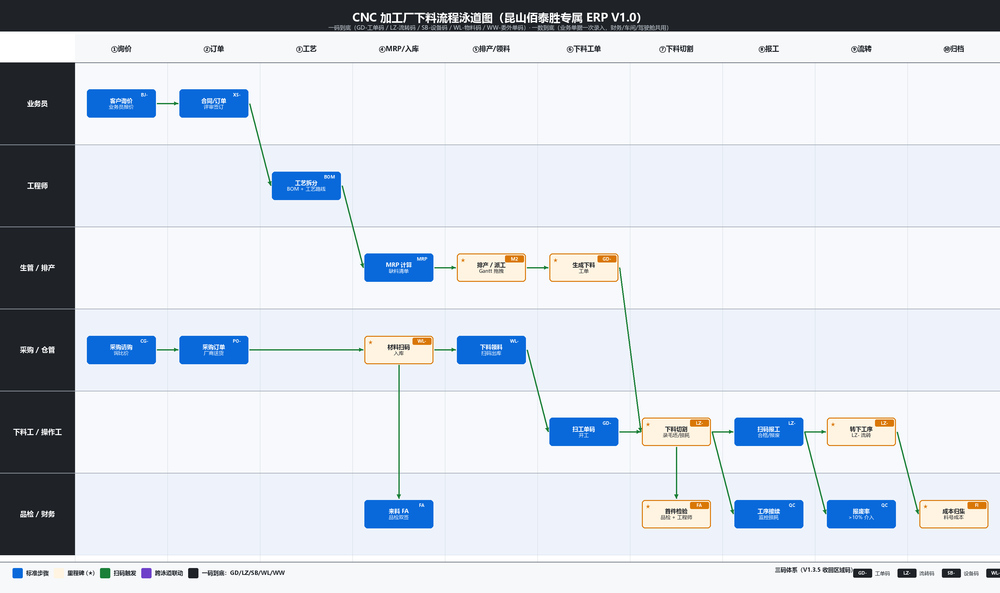

# 下料工操作手册（昆山佰泰胜专属 ERP V1.0 · A4 横向 2 页装订）

> **V1.0 / 2026-06 / 合同 XP-ZPF202606082405 / 第 1 页 共 2 页**

## 一、3 步搞定（口诀：扫一次、切完录、系统出码、转下工序）

| 步 | APP 操作 | 耗时 |
|----|---------|------|
| **① 开工** | 打开 APP → 扫 **GD-** → 选锯床（可扫 SB-）→【开工】 | 10s |
| **② 下料** | 扫 GD- → 录**毛坯数 / 重量 / 锯口宽 / 余料** →【提交】 | 1-3min |
| **③ 报工 + 流转** | 录**完工 / 合格 / 报废** → 系统**自动生成 LZ-** → 打印贴码 → 转 CNC | 30s |

**5 类码**：**GD-** 工单（必扫）/ **LZ-** 流转（贴毛坯件）/ **SB-** 设备（可选）/ **WL-** 物料（仓管管）/ **WW-** 委外单（仓管管）

## 二、9 类异常 + 3 红线 + 5 贴士

| 异常 # | 处理 | 红线 🚫 | 贴士 ✅ |
|---|---|---|---|
| 1 扫码扫不出 | 擦拭/补光/手动输 GD- | **不扫码私自开工** → 当日无效+扣绩效 | 上班先看 APP【待办】红=急 |
| 2 工单不在待办 | 找生管 | **虚报数** → ¥500/次，严重按规章 | 扫 SB- 自动选机台+加载参数 |
| 3 领料库存不足 | APP"触发采购"→先扫余料库 | **LZ- 不贴/贴错** → 全批返工+扣绩效 | **余料必录**（5cm 也录）系统优先消耗 |
| 4 锯床故障 | 扫 SB-→报障→找设备员 | | 报废必填原因（料/工/设/人） |
| 5 **报废率 > 10%** | **立即停机**→点【报品检】 | | 下班前清待办：报工+LZ+余料 |
| 6 数量与单不符 | 不私改→找工程师 | | |
| 7 报工后想改数 | APP【我的报工】→找生管撤销 | | |
| 8 APP 闪退 | 切离线（500 条）→找 IT | | |
| 9 离线缓存满 | 弹窗→找 IT 查网络 | | |

**找谁（联系方式见车间公告栏 / APP 首页【通讯录】）**：排产→生管 / 工艺→工程师 / 物料→仓管 / 锯床→设备员 / 报废→品检 / APP→IT

## 三、下料流程全景（你只负责泳道 ⑥⑦⑧⑨）

> 绿色箭头 = 流程 · ★ = 里程碑 · 你的工作在**下料工·操作工**泳道 ⑥下料工单 → ⑦下料切割 → ⑧报工 → ⑨流转 四步。

---

**签收**：下料工 ____________  生管 ____________  车间主任 ____________  日期：2026 年 ___ 月 ___ 日 · 本手册 V1.0 配套合同附件 B 培训交付计划，V1.1 系统上线后修订。
